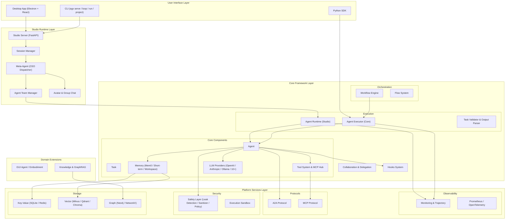

# AgenticX: Unified Multi-Agent Framework

<div align="center">
<!--  -->


<!-- [](https://www.python.org/downloads/) -->
[](https://www.apache.org/licenses/LICENSE-2.0)
[](https://pypi.org/project/agenticx/)
[](https://pypi.org/project/agenticx/)
[](https://deepwiki.com/DemonDamon/AgenticX)

[Architecture](#system-architecture) • [Features](#core-features) • [Quick Start](#quick-start) • [Examples](#complete-examples) • [Progress](#development-progress)

</div>

---

**Language / 语言**: [English](README.md) | [中文](README_ZN.md)

---

## Security advisory

**LiteLLM (PyPI):** Malicious releases **`litellm` 1.82.7 and 1.82.8** were removed from PyPI after reports that they could **exfiltrate API keys**. If you ever installed either version, **uninstall** them, **rotate any credentials** that may have been exposed, and **upgrade** to a release the upstream project and PyPI list as safe (for example **1.82.9+**, per current upstream guidance). Check your environment with `pip show litellm`.

---

## Vision

**AgenticX** aims to create a unified, scalable, production-ready multi-agent application development framework, empowering developers to build everything from simple automation assistants to complex collaborative intelligent agent systems.

## System Architecture

<div align="center">

</div>

The framework is organized into 5 tiers: **User Interface** (Desktop / CLI / SDK) → **Studio Runtime** (Session Manager, Meta-Agent, Team Manager, Avatar & Group Chat) → **Core Framework** (Orchestration, Execution, Agent, Memory, Tools, LLM Providers, Hooks) → **Platform Services** (Observability, Protocols, Security, Storage) → **Domain Extensions** (GUI Agent, Knowledge & GraphRAG, AgentKit Integration).

## Core Features

### Core Framework
- **Agent Core**: Agent execution engine based on 12-Factor Agents methodology, with Meta-Agent CEO dispatcher, agent team management, think-act loop, event-driven architecture, self-repair, and overflow recovery
- **Embeddable ReActAgent (SDK primitive)**: Canonical async function-calling ReAct loop (`ainvoke`/`astream`) with a typed `AgentEvent` stream, multi-turn history in/out, parallel tool execution, and optional loop-detector / compactor / offloader injection — zero Studio/CLI coupling (legacy text-JSON `TextReActAgent` facade kept for compatibility)
- **Unified Offload**: `Offloader` protocol + filesystem-backed `FileOffloader` keep large tool results / compressed context out of live history (inline reference placeholders, retrieved on demand); plus an in-workspace MCP gateway that runs MCP servers inside the sandbox
- **Orchestration Engine**: Graph-based workflow engine + Flow system with decorators, execution plans, conditional routing, and parallel execution
- **Tool System**: Unified tool interface with function decorators, MCP Hub (multi-server aggregation), remote tools v2, OpenAPI toolset, sandbox tools, skill bundles, and document routers
- **Memory System**: Hierarchical memory (core / episodic / semantic), Mem0 deep integration, workspace memory, short-term memory, memory decay, hybrid search, compaction flush, MCP memory, and memory intelligence engine
- **LLM Providers**: 15+ providers — OpenAI, Anthropic, Ollama, Gemini, Kimi/Moonshot, MiniMax, Ark/VolcEngine, Zhipu, Qianfan, Bailian/Dashscope — with response caching, transcript sanitizer, and failover routing
- **Communication Protocols**: A2A inter-agent protocol (client / server / AgentCard / skill-as-tool), MCP resource access protocol
- **Task Validation**: Pydantic-based output parsing, auto-repair, and guiderails

### Avatar & Team Collaboration
- **Avatar System**: Avatar registry (CRUD), group chat with multiple routing strategies (user-directed / meta-routed / round-robin)
- **Meta-Agent Runtime**: CEO dispatcher with dynamic sub-agent orchestration, team management with concurrency limits, archived snapshots, and session isolation
- **Collaboration Patterns**: Delegation, role-playing, conversation management, task locks, and collaboration metrics

### Knowledge & Retrieval
- **Knowledge Base**: Document processing pipeline with chunkers, readers, extractors, and graph builders (GraphRAG)
- **Multi-Brain Knowledge**: Isolatable, per-avatar/session mountable "doc brain + code brain" architecture with cross-brain aggregated search
- **Code Semantic Index**: Hybrid (vector + BM25) retrieval across multiple codebases, wired into the "code brain"
- **Retrieval System**: Vector retriever, BM25 retriever, graph retriever, hybrid retriever, auto-retriever, and reranker
- **Embeddings**: OpenAI, Bailian, SiliconFlow, LiteLLM, with smart routing

### Skills & Self-Evolution
- **Skill System**: Registration and full lifecycle management — dangerous-pattern security scan gate, 5-strategy fuzzy patch, `.changelog` versioning, source tagging, and per-skill enable/disable
- **Skill Self-Evolution**: Captures tool-call observations at runtime and auto-distills new skills via background LLM session review; quality gate, usage stats, and deprecation form the lifecycle loop
- **Extension Ecosystem (AGX Bundle)**: Bundle definitions (skills / mcp_servers / avatars / memory_templates), local install/uninstall, multi-source registry aggregated search

### Long-Horizon Autonomous Coding
- **Long-Run Orchestration**: Polls multiple task sources (manual queue / Cron / Linear / project features), per-task isolated workspaces, stall self-healing, continuation/failure dual-track backoff, incremental token accounting
- **Project State Machine**: Disk-backed single source of truth with a versioned feature state machine, file locks / atomic writes, powering an auditable "init → implement → verify → commit" loop

### Developer Experience
- **CLI Tools** (`agx`): serve, studio, loop, run, project, deploy, codegen, docs, skills, hooks, debug, scaffold, and config management
- **Web UI (Studio)**: FastAPI-based management server with session management, real-time WebSocket, and protocol support
- **Desktop App**: Electron + React + Zustand + Vite, Pro/Lite dual mode (multi-pane / single-pane), command palette, settings panel, avatar sidebar, sub-agent panel, session history, and workspace panel
- **IM Remote Gateway**: Remote command relay and reply delivery for Feishu / WeCom / DingTalk / personal WeChat (iLink) → cloud → local Agent
- **Claude Code Bridge**: Token-protected local HTTP / NDJSON control plane driving local Claude Code in headless (stream-json) or visible TUI (PTY) modes

### Enterprise Security
- **Safety Layer**: Leak detection, input sanitizer, advanced injection detector, policy engine (rules / severity / actions), input validator, sandbox policy, and audit logging
- **Sandbox**: Docker / Microsandbox / Subprocess / remote HTTP backends (tiered factory auto-selection); Jupyter kernel manager, stateful code interpreter, sandbox templates, JSONL execution audit
- **Session Security**: Database-backed sessions, write locks, in-memory sessions, session-level multi-tenant (tenant_id) isolation

### Observability & Evaluation
- **Monitoring**: Complete callback system, real-time metrics, Prometheus/OpenTelemetry integration, trajectory analysis, span tree, WebSocket streaming
- **Evaluation Framework**: EvalSet-based evaluation, LLM judge, composite judge, span evaluator, trajectory matcher, trace-to-evalset converter
- **Data Export**: Multi-format export (JSON / CSV / Prometheus), time series analysis

### Storage Layer
- **Key-Value**: SQLite, Redis, PostgreSQL, MongoDB, InMemory
- **Vector**: Milvus, Qdrant, Chroma, Faiss, PgVector, Pinecone, Weaviate
- **Graph**: Neo4j, Nebula
- **Object**: S3, GCS, Azure
- **Unified Manager**: Storage router, migration support, unified storage interface

### GUI Agent / Embodiment
- **Action Reflection**: A/B/C result classification with heuristic and VLM reflection modes
- **Stuck Detection & Recovery**: Consecutive failure detection, repeat pattern recognition, intelligent recovery strategy recommendation
- **Action Caching**: Action-tree-based trajectory caching with exact and fuzzy matching (up to 9x speedup)
- **REACT Output Parsing**: Standardized REACT format parsing with compact action schema
- **Device-Cloud Routing**: Dynamic selection of on-device or cloud model based on task complexity and sensitivity
- **DAG Task Verification**: DAG-based multi-path task verification with dual semantic dependencies
- **Human-in-the-Loop**: Collector, component, and event model for human oversight

## Quick Start

### Installation

#### Option 1: Install from PyPI (Recommended)

```bash
# Core install (lightweight, no torch, installs in seconds)
pip install agenticx

# Install optional features as needed
pip install "agenticx[memory]"      # Memory: mem0, chromadb, qdrant, redis, milvus
pip install "agenticx[document]"    # Document processing: PDF, Word, PPT parsing
pip install "agenticx[graph]"       # Knowledge graph: networkx, neo4j, community detection
pip install "agenticx[llm]"         # Extra LLMs: anthropic, ollama
pip install "agenticx[monitoring]"  # Observability: prometheus, opentelemetry
pip install "agenticx[mcp]"         # MCP protocol
pip install "agenticx[database]"    # Database backends: postgres, SQLAlchemy
pip install "agenticx[data]"        # Data analysis: pandas, scikit-learn, matplotlib
pip install "agenticx[ocr]"         # OCR (pulls in torch ~2GB): easyocr
pip install "agenticx[volcengine]"  # Volcengine AgentKit
pip install "agenticx[all]"         # Everything
```

> **Tip**: The core package includes only ~27 lightweight dependencies and installs in seconds. Heavy dependencies (torch, pandas, etc.) are optional extras - install only what you need.

> **Browser automation**: To run [browser-use](https://github.com/browser-use/browser-use) as an MCP server from AgenticX (`mcp_connect` / `mcp_call`), see [examples/browser-use-mcp.md](examples/browser-use-mcp.md).

> **Desktop MCP upgrades (2026-04)**: Near Settings now supports MCP brand auto-discovery (Cursor / Trae / Claude / OpenClaw / Hermes / Codex), built-in Monaco JSON editor with schema validation, and one-click install from ModelScope MCP marketplace.

#### Option 2: Install from Source (Development)

```bash
# Clone repository
git clone https://github.com/DemonDamon/AgenticX.git
cd AgenticX

# Using uv (recommended, 10-100x faster than pip)
pip install uv
uv pip install -e .                  # Core install
uv pip install -e ".[memory,graph]"  # Add optional features
uv pip install -e ".[all]"           # Everything
uv pip install -e ".[dev]"           # Development tools

# Or using pip
pip install -e .
pip install -e ".[all]"
```

#### Environment Setup

```bash
# Set environment variables
export OPENAI_API_KEY="your-api-key"
export ANTHROPIC_API_KEY="your-api-key"  # Optional
```

> **Complete Installation Guide**: For system dependencies (antiword, tesseract) and advanced document processing features, see [INSTALL.md](INSTALL.md)

### CLI Quick Start

After installation, the `agx` command-line tool is available:

```bash
# View version
agx --version

# Create a new project
agx project create my-agent --template basic

# Start the API server
agx serve --port 8000

# Parse documents (PDF/PPT/Word etc.)
agx mineru parse report.pdf --output ./parsed
```

> **Full CLI Reference**: See [docs/cli.md](docs/cli.md) for complete command documentation.

### Create Your First Agent

```python
from agenticx import Agent, Task, AgentExecutor
from agenticx.llms import OpenAIProvider

# Create agent
agent = Agent(
    id="data-analyst",
    name="Data Analyst",
    role="Data Analysis Expert", 
    goal="Help users analyze and understand data",
    organization_id="my-org"
)

# Create task
task = Task(
    id="analysis-task",
    description="Analyze sales data trends",
    expected_output="Detailed analysis report"
)

# Configure LLM
llm = OpenAIProvider(model="gpt-4")

# Execute task
executor = AgentExecutor(agent=agent, llm=llm)
result = executor.run(task)
print(result)
```

### Tool Usage Example

```python
from agenticx.tools import tool

@tool
def calculate_sum(x: int, y: int) -> int:
    """Calculate the sum of two numbers"""
    return x + y

@tool  
def search_web(query: str) -> str:
    """Search web information"""
    return f"Search results: {query}"

# Agents will automatically invoke these tools
```

## Complete Examples

We provide rich examples demonstrating various framework capabilities:

### Agent Core (M5)

**Single Agent Example**
```bash
# Basic agent usage
python examples/m5_agent_demo.py
```
- Demonstrates basic agent creation and execution
- Tool invocation and error handling
- Event-driven execution flow

**Multi-Agent Collaboration**
```bash
# Multi-agent collaboration example
python examples/m5_multi_agent_demo.py
```
- Multi-agent collaboration patterns
- Task distribution and result aggregation
- Inter-agent communication

### Orchestration & Validation (M6 & M7)

**Simple Workflow**
```bash
# Basic workflow orchestration
python examples/m6_m7_simple_demo.py
```
- Workflow creation and execution
- Task output parsing and validation
- Conditional routing and error handling

**Complex Workflow**
```bash
# Complex workflow orchestration
python examples/m6_m7_comprehensive_demo.py
```
- Complex workflow graph structures
- Parallel execution and conditional branching
- Complete lifecycle management

### Agent Communication (M8)

**A2A Protocol Demo**
```bash
# Inter-agent communication protocol
python examples/m8_a2a_demo.py
```
- Agent-to-Agent communication protocol
- Distributed agent systems
- Service discovery and skill invocation

### Observability Monitoring (M9)

**Complete Monitoring Demo**
```bash
# Observability module demo
python examples/m9_observability_demo.py
```
- Real-time performance monitoring
- Execution trajectory analysis
- Failure analysis and recovery recommendations
- Data export and report generation

### Memory System

**Basic Memory Usage**
```bash
# Memory system example
python examples/memory_example.py
```
- Long-term memory storage and retrieval
- Context memory management

**Healthcare Scenario**
```bash
# Healthcare memory scenario
python examples/mem0_healthcare_example.py  
```
- Medical knowledge memory and application
- Personalized patient information management

### Human-in-the-Loop

**Human Intervention Flow**
```bash
# Human-in-the-loop example
python examples/human_in_the_loop_example.py
```
- Human approval workflows
- Human-machine collaboration patterns
- Risk control mechanisms

Detailed documentation: [examples/README_HITL.md](examples/README_HITL.md)

### LLM Integration

**Chatbot**
```bash
# LLM chat example
python examples/llm_chat_example.py
```
- Multi-model support demonstration
- Streaming response handling
- Cost control and monitoring

### Security Sandbox

**Code Execution Sandbox**
```bash
# Micro-sandbox example
python examples/microsandbox_example.py
```
- Secure code execution environment
- Resource limits and isolation

Technical blog: [examples/microsandbox_blog.md](examples/microsandbox_blog.md)

### Intent Recognition Service

**Intelligent Intent Recognition System**
```bash
# Intent recognition service example
python examples/agenticx-for-intent-recognition/main.py
```

A production-grade, layered intent recognition service built entirely on the AgenticX framework, demonstrating real-world usage of Agents, Workflows, Tools, and Storage systems.

Architecture:
- **Agent Layer**: Hierarchical agent design — a base `IntentRecognitionAgent` (LLM-powered) with specialized agents (`GeneralIntentAgent`, `SearchIntentAgent`, `FunctionIntentAgent`) for fine-grained classification
- **Workflow Engine**: Pipeline-based orchestration — preprocessing → intent classification → entity extraction → rule matching → post-processing; plus dedicated workflows for each intent type
- **Tool System**: Hybrid entity extraction (`UIE` + `LLM` + `Rule` extractors with confidence-weighted fusion), regex/full-text matching, and a full post-processing suite (confidence adjustment, conflict resolution, entity optimization, intent refinement)
- **API Gateway**: Async service layer with rate limiting, concurrent control, batch processing, health checks, and performance metrics
- **Storage**: SQLite-backed data persistence for training data management via `UnifiedStorageManager`
- **Data Models**: Pydantic-based type-safe data contracts for API requests/responses and domain objects

Key capabilities:
- **Three-tier Intent Classification**: General dialogue (greetings, chitchat), information search (factual/how-to/comparison queries), and function/tool invocation
- **Hybrid Entity Extraction**: Combines UIE models, LLM, and rule-based extractors with intelligent fusion strategies
- **Full Post-processing Pipeline**: Confidence adjustment, conflict resolution, entity optimization, and intent refinement
- **Extensible Design**: Add new intent types by simply creating a new agent and workflow — zero changes to existing code

See: [examples/agenticx-for-intent-recognition/](examples/agenticx-for-intent-recognition/)

### GUI Agent / Embodiment (M16)

**GUI Automation Agent**
```bash
# GUI Agent example
python examples/agenticx-for-guiagent/AgenticX-GUIAgent/main.py
```
- Complete GUI automation framework with human-aligned learning
- Action reflection (A/B/C classification) and stuck detection
- Action caching system for performance optimization
- REACT output parsing and compact action schema
- Device-Cloud routing for intelligent model selection
- DAG-based task verification

Key capabilities:
- **Action Reflection**: Automatic action result classification (success/wrong_state/no_change)
- **Stuck Detection**: Continuous failure detection and recovery strategy recommendation
- **Action Caching**: Trajectory caching with exact and fuzzy matching (up to 9x speedup)
- **REACT Parsing**: Standardized REACT format output parsing
- **Smart Routing**: Dynamic device-cloud model selection based on task complexity and sensitivity
- **DAG Verification**: Multi-path task verification with dual-semantic dependencies

See: [examples/agenticx-for-guiagent/](examples/agenticx-for-guiagent/)

### More Application Examples

| Project | Description | Path |
|---------|-------------|------|
| **Agent Skills** | Skill discovery, matching, and SOP-driven skill execution for agents | [examples/agenticx-for-agent-skills/](examples/agenticx-for-agent-skills/) |
| **AgentKit** | Volcengine AgentKit integration with Docker-ready agent deployment | [examples/agenticx-for-agentkit/](examples/agenticx-for-agentkit/) |
| **ChatBI** | Conversational BI — natural language to data insights | [examples/agenticx-for-chatbi/](examples/agenticx-for-chatbi/) |
| **Deep Research** | Multi-source deep research and report generation | [examples/agenticx-for-deepresearch/](examples/agenticx-for-deepresearch/) |
| **Doc Parser** | Intelligent document parsing (PDF, Word, PPT) | [examples/agenticx-for-docparser/](examples/agenticx-for-docparser/) |
| **Finance** | Financial news hunting and analysis | [examples/agenticx-for-finance/](examples/agenticx-for-finance/) |
| **Future Prediction** | Predictive analysis and forecasting | [examples/agenticx-for-future-prediction/](examples/agenticx-for-future-prediction/) |
| **GraphRAG** | Knowledge graph-enhanced retrieval-augmented generation | [examples/agenticx-for-graphrag/](examples/agenticx-for-graphrag/) |
| **Math Modeling** | Mathematical modeling assistant | [examples/agenticx-for-math-modeling/](examples/agenticx-for-math-modeling/) |
| **Model Architecture Discovery** | Automated model architecture search and discovery | [examples/agenticx-for-modelarch-discovery/](examples/agenticx-for-modelarch-discovery/) |
| **Query Optimizer** | SQL/query optimization agent | [examples/agenticx-for-queryoptimizer/](examples/agenticx-for-queryoptimizer/) |
| **Sandbox** | Secure code execution sandbox | [examples/agenticx-for-sandbox/](examples/agenticx-for-sandbox/) |
| **Spec Coding** | Specification-driven code generation | [examples/agenticx-for-spec-coding/](examples/agenticx-for-spec-coding/) |
| **Vibe Coding** | AI-assisted creative/vibe coding | [examples/agenticx-for-vibecoding/](examples/agenticx-for-vibecoding/) |

## Technical Architecture



## Development Progress

### ✅ Completed Modules (M1-M11, M13-M17)

| Module | Status | Description |
|---------|--------|-------------|
| **M1** | ✅ | Core Abstraction Layer — Agent, Task, Tool, Workflow, Event Bus, Component, and Pydantic data contracts |
| **M2** | ✅ | LLM Service Layer — 15+ providers (OpenAI / Anthropic / Ollama / Gemini / Kimi / MiniMax / Ark / Zhipu / Qianfan / Bailian), response caching, failover routing |
| **M3** | ✅ | Tool System — Function decorators, MCP Hub, remote tools v2, OpenAPI toolset, sandbox tools, skill bundles, document routers |
| **M4** | ✅ | Memory System — Hierarchical (core / episodic / semantic), Mem0, workspace, short-term, memory decay, hybrid search, memory intelligence engine |
| **M5** | ✅ | Agent Core — Meta-Agent CEO dispatcher, think-act loop, event-driven architecture, self-repair, overflow recovery, reflection |
| **M6** | ✅ | Task Validation — Pydantic-based output parsing, auto-repair, guiderails |
| **M7** | ✅ | Orchestration Engine — Graph-based workflow engine + Flow system with decorators, execution plans, conditional routing, parallel execution |
| **M8** | ✅ | Communication Protocols — A2A (client / server / AgentCard / skill-as-tool), MCP resource access, AGUI protocol |
| **M9** | ✅ | Observability — Callbacks, real-time monitoring, trajectory analysis, span tree, WebSocket streaming, Prometheus / OpenTelemetry integration |
| **M10** | ✅ | Developer Experience — CLI (`agx` with 15+ commands), Studio Server (FastAPI), Desktop App (Electron + React + Zustand, Pro/Lite dual mode) |
| **M11** | ✅ | Enterprise Security — Safety layer (leak detection / sanitizer / injection detector / policy / audit), Sandbox (Docker / Microsandbox / Subprocess / Jupyter kernel / code interpreter) |
| **M13** | ✅ | Knowledge & Retrieval — Knowledge base with document processing, chunkers, graphers (GraphRAG), readers; retrieval (vector / BM25 / graph / hybrid / auto); embeddings (OpenAI / Bailian / SiliconFlow / LiteLLM) |
| **M14** | ✅ | Avatar & Collaboration — Avatar registry, group chat (user-directed / meta-routed / round-robin), delegation, role-playing, conversation patterns, team management |
| **M15** | ✅ | Evaluation Framework — EvalSet, LLM judge, composite judge, span evaluator, trajectory matcher, trace converter |
| **M16** | ✅ | Embodiment — GUI Agent framework with action reflection, stuck detection, action caching, REACT parsing, device-cloud routing, DAG verification, human-in-the-loop |
| **M17** | ✅ | Storage Layer — Key-Value (SQLite / Redis / PostgreSQL / MongoDB), Vector (Milvus / Qdrant / Chroma / Faiss / PgVector / Pinecone / Weaviate), Graph (Neo4j / Nebula), Object (S3 / GCS / Azure) |

### 🚧 Planned Modules

| Module | Status | Description |
|---------|--------|-------------|
| **M12** | 🚧 | Agent Evolution — Architecture search, knowledge distillation, adaptive planning |
| **M18** | 🚧 | Multi-tenancy & RBAC — Session-level `tenant_id` isolation landed; fine-grained permission control in progress |

### 🆕 Recent Capability Additions (H1 2026)

| Capability | Status | Description |
|------------|--------|-------------|
| **Skill Self-Evolution** | ✅ | Runtime tool-call observation capture, auto-skill creation via session review, quality gate / usage stats / deprecation loop (`learning`) |
| **Multi-Brain Knowledge** | ✅ | Isolatable/mountable "doc brain + code brain" with cross-brain search (`brain`) + multi-codebase hybrid semantic index (`code_index`) |
| **Long-Horizon Coding** | ✅ | Long-run orchestration (multi-source / isolated workspaces / stall self-healing / continuation backoff, `longrun`) + disk-backed project state machine (`project_state`) |
| **IM Channel Integration** | ✅ | Remote command gateway for Feishu / WeCom / DingTalk / personal WeChat (iLink) (`gateway`) |
| **Claude Code Bridge** | ✅ | Token-protected local HTTP/NDJSON control plane, headless / visible TUI dual mode (`cc_bridge`) |
| **Extension Ecosystem** | ✅ | AGX Bundle definitions, local install/uninstall, multi-source registry aggregated search (`extensions`) |
| **Embeddable ReActAgent** | ✅ | Canonical async function-calling ReAct SDK primitive with typed event stream, multi-turn history, parallel tools, optional loop-detector / compactor / offloader, zero Studio/CLI coupling (`agents`) |
| **Unified Offload & MCP Gateway** | ✅ | `Offloader` protocol + `FileOffloader` for out-of-history large payloads, plus in-workspace MCP gateway (AgentScope v2 P0 internalization, `core.offload` / `sandbox.mcp_gateway`) |

## Core Advantages

- **Unified Abstraction**: Clear and consistent core abstractions, avoiding conceptual confusion
- **Pluggable Architecture**: All components are replaceable, avoiding vendor lock-in
- **Enterprise-Grade Monitoring**: Complete observability, production-ready
- **Security First**: Built-in security mechanisms and multi-tenant support
- **High Performance**: Optimized execution engine and concurrent processing
- **Rich Ecosystem**: Complete toolset and example library

## System Requirements

- **Python**: 3.10+
- **Memory**: 4GB+ RAM recommended
- **System**: Windows / Linux / macOS
- **Core Dependencies**: ~27 lightweight packages, installs in seconds (see `pyproject.toml`)
- **Optional Dependencies**: 15 feature groups available via `pip install "agenticx[xxx]"`

## Contributing

We welcome community contributions! Please refer to:

1. Submit Issues to report bugs or request features
2. Fork the project and create feature branches
3. Submit Pull Requests, ensuring all tests pass
4. Participate in code reviews and discussions

## Acknowledgements / Upstream Credits

The personal WeChat (iLink) channel integration in AgenticX was built on top of the **openilink-sdk-go** library from [OpeniLink Hub](https://github.com/openilink/openilink-hub). We specifically relied on:

- **QR code binding flow** — `FetchQRCode` / `PollQRStatus` APIs for the scan-to-bind UX
- **Message monitoring** — `client.Monitor()` for real-time inbound message streaming  
- **Outbound messaging** — `SendText` / `Push` for reply delivery with `context_token` routing
- **CDN media handling** — `DownloadMedia` / `DownloadVoice` for encrypted WeChat media

OpeniLink Hub's [OpenClaw App](https://github.com/openilink/openilink-hub) also demonstrated an AI Agent gateway integration pattern that informed our adapter architecture.

We did **not** include OpeniLink Hub's web console, App Marketplace, or multi-bot management features. AgenticX's **core multi-agent runtime**, **session management**, and **Desktop UI** remain fully independent implementations.

> OpeniLink Hub — MIT License — [github.com/openilink/openilink-hub](https://github.com/openilink/openilink-hub)

Additional reference: [WorkBuddy — WeixinBot Guide](https://www.codebuddy.cn/docs/workbuddy/WeixinBot-Guide) for iLink protocol usage patterns.

**Desktop development:** The iLink Go sidecar binary is **not** committed to this repository. Before using the personal WeChat bridge locally, run `make build` in [`packaging/wechat-sidecar/`](packaging/wechat-sidecar/) (requires Go 1.22+). See [`packaging/wechat-sidecar/README.md`](packaging/wechat-sidecar/README.md).

## License

This project is licensed under the Apache License, Version 2.0 — see the [LICENSE](LICENSE) file for details.

## Star History

[](https://star-history.com/#DemonDamon/AgenticX&Date)

## Acknowledgments

AgenticX would not exist in its current form without the inspiration, architectural ideas, and engineering wisdom we drew from the open-source community. We have studied the following projects in depth, and we are genuinely grateful to every author, contributor, and community behind them.

| Project | Repository | What we learned |
|---------|-----------|-----------------|
| **A2A** | [a2aproject/A2A](https://github.com/a2aproject/A2A) | Agent-to-Agent protocol design |
| **AgentCPM-GUI** | [OpenBMB/AgentCPM-GUI](https://github.com/OpenBMB/AgentCPM-GUI) | Compact GUI action schema & RFT training |
| **ADK Python** | [google/adk-python](https://github.com/google/adk-python) | Agent lifecycle, runner abstractions |
| **ag-ui** | [ag-ui-protocol/ag-ui](https://github.com/ag-ui-protocol/ag-ui) | Agent–UI streaming protocol |
| **AgentKit SDK** | [volcengine/agentkit-sdk-python](https://github.com/volcengine/agentkit-sdk-python) | Agent deployment & skill packaging |
| **AgentRun SDK** | [Serverless-Devs/agentrun-sdk-python](https://github.com/Serverless-Devs/agentrun-sdk-python) | Serverless agent runtime patterns |
| **AgentScope** | [agentscope-ai/agentscope](https://github.com/agentscope-ai/agentscope) | Multi-agent communication & pipeline |
| **Agno** | [agno-agi/agno](https://github.com/agno-agi/agno) | Lightweight agent framework design |
| **Camel** | [camel-ai/camel](https://github.com/camel-ai/camel) | Role-playing agents & society simulation |
| **Cherry Studio** | [CherryHQ/cherry-studio](https://github.com/CherryHQ/cherry-studio) | Desktop UX, MCP integration, skill system |
| **Claude Code** | [anthropics/claude-code](https://github.com/anthropics/claude-code) | Agentic CLI UX & plugin architecture |
| **CLI-Anything** | [HKUDS/CLI-Anything](https://github.com/HKUDS/CLI-Anything) | CLI-native agent harness |
| **ClawTeam** | [HKUDS/ClawTeam](https://github.com/HKUDS/ClawTeam) | Multi-agent team coordination |
| **CodexMonitor** | [Dimillian/CodexMonitor](https://github.com/Dimillian/CodexMonitor) | Desktop monitoring & Tauri app patterns |
| **CrewAI** | [crewAIInc/crewAI](https://github.com/crewAIInc/crewAI) | Crew orchestration, flow & memory system |
| **DeepWiki Open** | [AsyncFuncAI/deepwiki-open](https://github.com/AsyncFuncAI/deepwiki-open) | Repository-level knowledge indexing |
| **Deer Flow** | [bytedance/deer-flow](https://github.com/bytedance/deer-flow) | Deep research workflow & skill harness |
| **Eigent** | [eigent-ai/eigent](https://github.com/eigent-ai/eigent) | Multi-agent workforce & SSE event spec |
| **Iron Claw** | [nearai/ironclaw](https://github.com/nearai/ironclaw) | Agent evaluation & benchmark harness |
| **JoyAgent / JD Genie** | [jd-opensource/joyagent-jdgenie](https://github.com/jd-opensource/joyagent-jdgenie) | Enterprise agent orchestration |
| **Khazix Skills** | [KKKKhazix/Khazix-Skills](https://github.com/KKKKhazix/Khazix-Skills) | Skill module structure & packaging |
| **Lobe Icons** | [lobehub/lobe-icons](https://github.com/lobehub/lobe-icons) | AI provider icon design system |
| **LoongSuite Python Agent** | [alibaba/loongsuite-python-agent](https://github.com/alibaba/loongsuite-python-agent) | OpenTelemetry GenAI instrumentation |
| **MAI-UI** | [Tongyi-MAI/MAI-UI](https://github.com/Tongyi-MAI/MAI-UI) | Device-cloud collaboration & GUI grounding |
| **Microsandbox** | [zerocore-ai/microsandbox](https://github.com/zerocore-ai/microsandbox) | Lightweight sandboxed code execution |
| **MobiAgent** | [IPADS-SAI/MobiAgent](https://github.com/IPADS-SAI/MobiAgent) | Mobile multi-stage planning |
| **MobileAgent** | [X-PLUG/MobileAgent](https://github.com/X-PLUG/MobileAgent) | Multi-agent mobile GUI automation |
| **Model Context Protocol** | [modelcontextprotocol/modelcontextprotocol](https://github.com/modelcontextprotocol/modelcontextprotocol) | Standardized LLM tool/resource protocol |
| **NVIDIA NemoClaw** | [NVIDIA/NemoClaw](https://github.com/NVIDIA/NemoClaw) | GPU-accelerated agent plugin system |
| **OpenClaw** | [openclaw/openclaw](https://github.com/openclaw/openclaw) | Open desktop agent platform & extensions |
| **OpenSandbox** | [alibaba/OpenSandbox](https://github.com/alibaba/OpenSandbox) | Container-based code sandbox |
| **OpenShell** | [NVIDIA/OpenShell](https://github.com/NVIDIA/OpenShell) | Rust-based secure agent shell |
| **OpenSkills** | [numman-ali/openskills](https://github.com/numman-ali/openskills) | Skill registry & discovery |
| **OWL** | [camel-ai/owl](https://github.com/camel-ai/owl) | Embodied multi-agent collaboration |
| **Pydantic AI** | [pydantic/pydantic-ai](https://github.com/pydantic/pydantic-ai) | Type-safe agent & eval framework |
| **Refly** | [refly-ai/refly](https://github.com/refly-ai/refly) | AI-native knowledge canvas UX |
| **Serverless Devs** | [Serverless-Devs/Serverless-Devs](https://github.com/Serverless-Devs/Serverless-Devs) | Serverless agent deployment toolchain |
| **Skills** | [anthropics/skills](https://github.com/anthropics/skills) | Skill definition format & lifecycle |
| **Spring AI** | [spring-projects/spring-ai](https://github.com/spring-projects/spring-ai) | Enterprise AI abstraction patterns |
| **SWE-agent** | [SWE-agent/SWE-agent](https://github.com/SWE-agent/SWE-agent) | Software engineering agent & ACR loop |
| **VE ADK** | [volcengine/veadk-python](https://github.com/volcengine/veadk-python) | Skills system & cloud-native A2A |
| **ZeroBoot** | [zerobootdev/zeroboot](https://github.com/zerobootdev/zeroboot) | Zero-config agent bootstrapping |

Thank you for building in the open. Your work has been a constant source of insight and motivation for the AgenticX team.

---

<div align="center">

**If AgenticX helps you, please give us a Star!**

[GitHub](https://github.com/DemonDamon/AgenticX) • [Documentation](coming-soon) • [Examples](examples/) • [Discussions](https://github.com/DemonDamon/AgenticX/discussions)

</div>