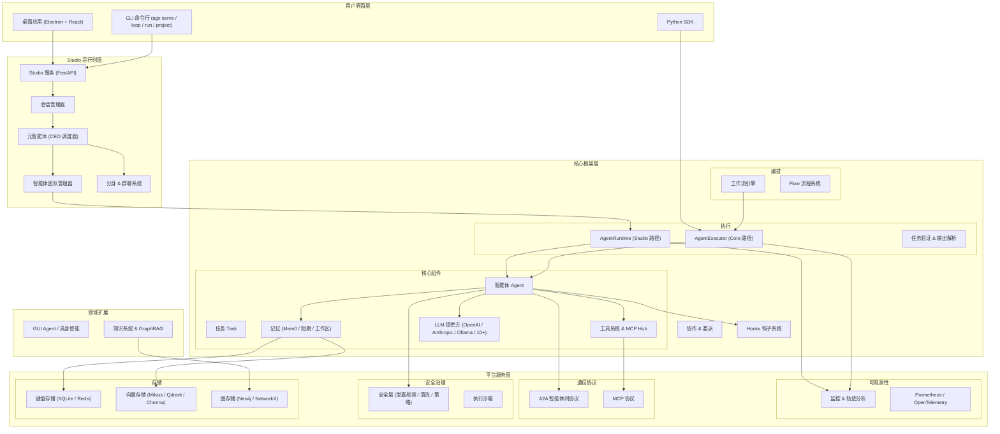

# AgenticX: 统一的多智能体框架

<div align="center">
<!--  -->


[](https://www.python.org/downloads/)
[](https://www.apache.org/licenses/LICENSE-2.0)
[](#)

**一个统一、可扩展、生产就绪的多智能体应用开发框架**

[系统架构](#系统架构) • [功能特性](#核心功能) • [快速开始](#快速开始) • [示例](#完整示例) • [进展](#开发进展)

</div>

---

**Language / 语言**: [English](README.md) | [中文](README_ZN.md)

---

## 安全公告

**LiteLLM（PyPI）：** 恶意版本 **`litellm` 1.82.7、1.82.8** 已从 PyPI 下架，有报告称存在 **窃取 API 密钥** 行为。若曾安装上述版本，请 **立即卸载**、**轮换可能泄露的凭据**，并 **升级** 至上游与 PyPI 当前标注为安全的版本（例如按上游说明使用 **1.82.9 及以上**）。可用 `pip show litellm` 检查本机环境。

---

## 愿景

AgenticX 旨在打造一个统一、可扩展、生产就绪的多智能体应用开发框架，赋予开发者构建从简单自动化助手到复杂协作式智能体系统的全部能力。

## 系统架构

<div align="center">

</div>

框架采用 5 层架构：**用户界面层**（桌面应用 / CLI / SDK）→ **Studio 运行时层**（会话管理器、Meta-Agent、团队管理器、分身与群聊）→ **核心框架层**（编排与执行、智能体、记忆、工具、LLM 提供方、Hooks 钩子）→ **平台服务层**（可观测性、通信协议、安全治理、存储）→ **领域扩展层**（GUI Agent、知识系统 & GraphRAG、AgentKit 集成）。

## 核心功能

### 核心框架
- **智能体核心**: 基于 12-Factor Agents 方法论的执行引擎，内置 Meta-Agent CEO 调度器、智能体团队管理、think-act 循环、事件驱动架构、自修复与溢出恢复
- **可嵌入 ReActAgent（SDK 原语）**: 规范的异步函数调用 ReAct 循环（`ainvoke`/`astream`），含类型化 `AgentEvent` 事件流、多轮历史进出、并行工具执行，以及可选的循环检测 / 上下文压缩 / Offloader 注入——零 Studio/CLI 耦合（保留 legacy 文本-JSON `TextReActAgent` 门面以向后兼容）
- **统一卸载（Offload）**: `Offloader` 协议 + 文件后端 `FileOffloader`，把大体积工具结果 / 压缩上下文移出实时历史（仅留内联引用占位符、按需取回）；并提供在沙箱内运行 MCP server 的 in-workspace MCP 网关
- **编排引擎**: 图式工作流引擎 + Flow 系统（装饰器、执行计划），支持条件路由与并行执行
- **工具系统**: 统一工具接口，支持函数装饰器、MCP Hub（多服务聚合）、远程工具 v2、OpenAPI 工具集、沙箱工具、技能包、文档路由
- **记忆系统**: 分层记忆（核心 / 情景 / 语义）、Mem0 深度集成、工作区记忆、短期记忆、记忆衰减、混合搜索、压缩刷写、MCP 记忆、记忆智能引擎
- **LLM 提供方**: 15+ 提供方 — OpenAI、Anthropic、Ollama、Gemini、Kimi/Moonshot、MiniMax、Ark/火山引擎、智谱、千帆、百炼/Dashscope — 支持响应缓存、转录清洗、故障转移路由
- **通信协议**: A2A 智能体间协议（客户端 / 服务端 / AgentCard / 技能即工具）、MCP 资源访问协议
- **任务验证**: 基于 Pydantic 的输出解析、自动修复与护栏机制

### 分身与团队协作
- **分身系统**: 分身注册中心（CRUD）、群聊支持多路由策略（用户指定 / 智能路由 / 轮流回复）
- **Meta-Agent 运行时**: CEO 调度器动态编排子智能体，团队管理含并发上限、归档快照、会话隔离
- **协作模式**: 委派、角色扮演、会话管理、任务锁、协作度量

### 知识与检索
- **知识库**: 文档处理流水线，含分块器、读取器、抽取器、图构建器（GraphRAG）
- **多脑知识库**: 可隔离、按分身 / 会话挂载的「文档脑 + 代码脑」架构，支持多脑聚合检索
- **代码语义索引**: 多代码库 hybrid（向量 + BM25）检索，与「代码脑」衔接
- **检索系统**: 向量检索、BM25 检索、图检索、混合检索、自动检索、重排序器
- **嵌入模型**: OpenAI、百炼、SiliconFlow、LiteLLM，支持智能路由

### 技能与自进化
- **技能系统**: 注册与全生命周期管理 — 危险模式安全扫描门禁、5 策略模糊 patch、`.changelog` 版本变更日志、来源标注与按 skill 启停
- **技能自进化**: 运行时采集工具调用观察，复杂会话后台 LLM 复盘自动沉淀新技能；质量门禁、使用统计、低效淘汰构成生命周期闭环
- **扩展生态 (AGX Bundle)**: Bundle 定义（skills / mcp_servers / avatars / memory_templates）、本地安装卸载、多源注册表聚合搜索

### 长程自主编码
- **长任务编排**: 多任务源（手动队列 / Cron / Linear / 项目特性）轮询、每任务隔离工作区、停滞自愈、续跑 / 失败双轨退避、增量 Token 计量
- **项目状态机**: 磁盘级单一事实来源，版本化特性状态机、文件锁 / 原子写，支撑「初始化 → 实现 → 验证 → 提交」可审计闭环

### 开发者体验
- **CLI 工具** (`agx`): serve、studio、loop、run、project、deploy、codegen、docs、skills、hooks、debug、scaffold、config 等 15+ 命令
- **Web UI (Studio)**: 基于 FastAPI 的管理服务器，支持会话管理、实时 WebSocket、协议对接
- **桌面应用**: Electron + React + Zustand + Vite，Pro/Lite 双模式（多窗格 / 单窗格），含命令面板、设置面板、分身侧栏、子智能体面板、会话历史、工作区面板
- **IM 远程网关**: 飞书 / 企业微信 / 钉钉 / 个人微信(iLink) → 云端 → 本机 Agent 的远程指令中继与回复下发
- **Claude Code 桥接**: 受 Token 保护的本机 HTTP / NDJSON 控制面，headless（stream-json）与可见 TUI（PTY）双模驱动本地 Claude Code

### 企业级安全
- **安全层**: 泄露检测、输入清洗器、高级注入检测器、策略引擎（规则 / 严重级别 / 动作）、输入验证器、沙箱策略、审计日志
- **沙箱**: Docker / Microsandbox / Subprocess / 远端 HTTP 四种后端（三档模式工厂自动选择）；Jupyter 内核管理器、有状态代码解释器、沙箱模板、JSONL 执行审计
- **会话安全**: 数据库级会话、写锁、内存会话、会话级多租户（tenant_id）隔离

### 可观测性与评估
- **监控**: 完整回调系统、实时指标、Prometheus/OpenTelemetry 集成、轨迹分析、Span Tree、WebSocket 流式推送
- **评估框架**: 基于 EvalSet 的评估、LLM 裁判、组合裁判、Span 评估器、轨迹匹配器、Trace 转换器
- **数据导出**: 多格式导出（JSON / CSV / Prometheus）、时间序列分析

### 存储层
- **键值存储**: SQLite、Redis、PostgreSQL、MongoDB、InMemory
- **向量存储**: Milvus、Qdrant、Chroma、Faiss、PgVector、Pinecone、Weaviate
- **图存储**: Neo4j、Nebula
- **对象存储**: S3、GCS、Azure
- **统一管理**: 存储路由器、迁移支持、统一存储接口

### GUI Agent / 具身智能
- **动作反思机制**: A/B/C 动作结果分类，支持启发式和 VLM 两种反思模式
- **卡住检测与恢复**: 连续失败检测、重复模式识别、智能恢复策略推荐
- **动作缓存系统**: 基于动作树的轨迹缓存，支持精确匹配和模糊匹配（可达 9x 加速）
- **REACT 输出解析**: 标准化的 REACT 格式解析，紧凑动作 Schema
- **Device-Cloud 路由**: 根据任务复杂度、敏感性动态选择设备端或云端模型
- **DAG 任务验证**: 基于 DAG 的多路径任务验证，支持双语义依赖
- **人机协作**: 采集器、组件与事件模型，支持人工监督介入

## 快速开始

### 安装

#### 方式一：从 PyPI 安装（推荐）

```bash
# 核心安装（轻量，无 torch，秒装）
pip install agenticx

# 按需安装可选功能
pip install "agenticx[memory]"      # 记忆系统: mem0, chromadb, qdrant, redis, milvus
pip install "agenticx[document]"    # 文档处理: PDF, Word, PPT 解析
pip install "agenticx[graph]"       # 知识图谱: networkx, neo4j, 社区检测
pip install "agenticx[llm]"         # 额外 LLM: anthropic, ollama
pip install "agenticx[monitoring]"  # 可观测性: prometheus, opentelemetry
pip install "agenticx[mcp]"         # MCP 协议
pip install "agenticx[database]"    # 数据库后端: postgres, SQLAlchemy
pip install "agenticx[data]"        # 数据分析: pandas, scikit-learn, matplotlib
pip install "agenticx[ocr]"         # OCR（会拉入 torch ~2GB）: easyocr
pip install "agenticx[volcengine]"  # 火山引擎 AgentKit
pip install "agenticx[all]"         # 全部功能
```

> **提示**: 核心包仅包含 ~27 个轻量依赖，安装速度极快。重量级依赖（如 torch、pandas 等）均已移至可选分组，按需安装即可。

> **MCP 桌面升级（2026-04）**: Near 设置页已支持 MCP 品牌自动扫描（Cursor / Trae / Claude / OpenClaw / Hermes / Codex）、内置 Monaco JSON 编辑器（含 schema 校验）以及 ModelScope MCP 市场一键安装。

#### 方式二：从源码安装（开发）

```bash
# 克隆仓库
git clone https://github.com/DemonDamon/AgenticX.git
cd AgenticX

# 使用 uv（推荐，比 pip 快 10-100 倍）
pip install uv
uv pip install -e .                  # 核心安装
uv pip install -e ".[memory,graph]"  # 按需加载可选功能
uv pip install -e ".[all]"           # 全部功能
uv pip install -e ".[dev]"           # 开发工具

# 或使用 pip
pip install -e .
pip install -e ".[all]"
```

#### 环境配置

```bash
# 设置环境变量
export OPENAI_API_KEY="your-api-key"
export ANTHROPIC_API_KEY="your-api-key"  # 可选
```

> **完整安装指南**: 关于系统依赖（antiword、tesseract）和高级文档处理功能的详细信息，请参阅 [INSTALL.md](INSTALL.md)

### CLI 快速上手

安装后，`agx` 命令行工具即可使用：

```bash
# 查看版本
agx --version

# 创建新项目
agx project create my-agent --template basic

# 启动 API 服务器
agx serve --port 8000

# 解析文档（PDF/PPT/Word 等）
agx mineru parse report.pdf --output ./parsed
```

> **完整 CLI 文档**: 详见 [docs/cli.md](docs/cli.md)

### 创建第一个智能体

```python
from agenticx import Agent, Task, AgentExecutor
from agenticx.llms import OpenAIProvider

# 创建智能体
agent = Agent(
    id="data-analyst",
    name="数据分析师",
    role="数据分析专家", 
    goal="帮助用户分析和理解数据",
    organization_id="my-org"
)

# 创建任务
task = Task(
    id="analysis-task",
    description="分析销售数据趋势",
    expected_output="详细的分析报告"
)

# 配置LLM
llm = OpenAIProvider(model="gpt-4")

# 执行任务
executor = AgentExecutor(agent=agent, llm=llm)
result = executor.run(task)
print(result)
```

### 工具使用示例

```python
from agenticx.tools import tool

@tool
def calculate_sum(x: int, y: int) -> int:
    """计算两个数的和"""
    return x + y

@tool  
def search_web(query: str) -> str:
    """搜索网络信息"""
    return f"搜索结果: {query}"

# 智能体会自动调用这些工具
```

## 完整示例

我们提供了丰富的示例来展示框架的各种功能：

### 智能体核心 (M5)

**单智能体示例**
```bash
# 基础智能体使用
python examples/m5_agent_demo.py
```
- 展示智能体的基本创建和执行
- 工具调用和错误处理
- 事件驱动的执行流程

**多智能体协作**
```bash
# 多智能体协作示例
python examples/m5_multi_agent_demo.py
```
- 多个智能体的协作模式
- 任务分发和结果聚合
- 智能体间的通信

### 编排与验证 (M6 & M7)

**简单工作流**
```bash
# 基础工作流编排
python examples/m6_m7_simple_demo.py
```
- 工作流的创建和执行
- 任务输出的解析和验证
- 条件路由和错误处理

**复杂工作流**
```bash
# 复杂工作流编排
python examples/m6_m7_comprehensive_demo.py
```
- 复杂的工作流图结构
- 并行执行和条件分支
- 完整的生命周期管理

### 智能体通信 (M8)

**A2A 协议演示**
```bash
# 智能体间通信协议
python examples/m8_a2a_demo.py
```
- Agent-to-Agent 通信协议
- 分布式智能体系统
- 服务发现和技能调用

### 可观测性监控 (M9)

**完整监控演示**
```bash
# 可观测性模块演示
python examples/m9_observability_demo.py
```
- 实时性能监控
- 执行轨迹分析
- 失败分析和恢复建议
- 数据导出和报告生成

### 记忆系统

**基础记忆使用**
```bash
# 记忆系统示例
python examples/memory_example.py
```
- 长期记忆的存储和检索
- 上下文记忆管理

**医疗场景应用**
```bash
# 医疗记忆场景
python examples/mem0_healthcare_example.py  
```
- 医疗知识的记忆和应用
- 个性化的患者信息管理

### 人机协作

**人工干预流程**
```bash
# 人机协作示例
python examples/human_in_the_loop_example.py
```
- 人工审批工作流
- 人机协作模式
- 风险控制机制

详细说明请参考: [examples/README_HITL.md](examples/README_HITL.md)

### LLM 集成

**聊天机器人**
```bash
# LLM聊天示例
python examples/llm_chat_example.py
```
- 多模型支持演示
- 流式响应处理
- 成本控制和监控

### 安全沙箱

**代码执行沙箱**
```bash
# 微沙箱示例
python examples/microsandbox_example.py
```
- 安全的代码执行环境
- 资源限制和隔离

技术博客: [examples/microsandbox_blog.md](examples/microsandbox_blog.md)

### 意图识别服务

**智能意图识别系统**
```bash
# 意图识别服务示例
python examples/agenticx-for-intent-recognition/main.py
```

一个完全基于 AgenticX 框架构建的生产级分层意图识别服务，展示了 Agent、Workflow、Tool、Storage 等核心系统的真实应用场景。

架构设计：
- **Agent 层**: 层次化智能体设计 — 基础 `IntentRecognitionAgent`（LLM 驱动）搭配专业智能体（`GeneralIntentAgent`、`SearchIntentAgent`、`FunctionIntentAgent`），实现细粒度意图分类
- **工作流引擎**: 流水线式编排 — 文本预处理 → 意图分类 → 实体抽取 → 规则匹配 → 后处理；每种意图类型还有专属工作流
- **工具系统**: 混合实体抽取（`UIE` + `LLM` + `Rule` 三源融合，置信度加权），正则/精确匹配工具，以及完整的后处理套件（置信度调整、冲突解决、实体优化、意图精化）
- **API 网关**: 异步服务层，支持限流、并发控制、批量处理、健康检查和性能指标监控
- **存储层**: 基于 SQLite 的数据持久化，通过 `UnifiedStorageManager` 管理训练数据
- **数据模型**: 基于 Pydantic 的类型安全数据契约，覆盖 API 请求/响应和领域对象

核心能力：
- **三层意图分类**: 通用对话（问候、闲聊）、信息搜索（事实/方法/对比查询）、工具/功能调用
- **混合实体抽取**: 融合 UIE 模型、LLM 和规则抽取器，支持多种智能融合策略
- **完整后处理流水线**: 置信度调整、冲突解决、实体优化、意图精化一体化处理
- **高可扩展性**: 新增意图类型只需添加新的 Agent 和 Workflow，无需修改已有代码

详见: [examples/agenticx-for-intent-recognition/](examples/agenticx-for-intent-recognition/)

### GUI Agent / 具身智能 (M16)

**GUI 自动化智能体**
```bash
# GUI Agent 示例
python examples/agenticx-for-guiagent/AgenticX-GUIAgent/main.py
```
- 完整的 GUI 自动化框架，基于人类对齐学习理念
- 动作反思（A/B/C 分类）和卡住检测
- 动作缓存系统，性能优化可达 9x 加速
- REACT 输出解析和紧凑动作 Schema
- Device-Cloud 路由，智能模型选择
- DAG 任务验证，多路径任务定义和验证

核心能力：
- **动作反思**: 自动动作结果分类（成功/错误状态/无变化）
- **卡住检测**: 连续失败检测和恢复策略推荐
- **动作缓存**: 轨迹缓存，支持精确匹配和模糊匹配（可达 9x 加速）
- **REACT 解析**: 标准化的 REACT 格式输出解析
- **智能路由**: 根据任务复杂度和敏感性动态选择设备端或云端模型
- **DAG 验证**: 多路径任务验证，支持双语义依赖

详见: [examples/agenticx-for-guiagent/](examples/agenticx-for-guiagent/)

### 更多应用示例

| 项目 | 描述 | 路径 |
|------|------|------|
| **Agent Skills** | 技能发现、匹配与 SOP 驱动的智能体技能执行 | [examples/agenticx-for-agent-skills/](examples/agenticx-for-agent-skills/) |
| **AgentKit** | 火山引擎 AgentKit 集成，支持 Docker 部署 | [examples/agenticx-for-agentkit/](examples/agenticx-for-agentkit/) |
| **ChatBI** | 对话式 BI — 自然语言驱动数据洞察 | [examples/agenticx-for-chatbi/](examples/agenticx-for-chatbi/) |
| **Deep Research** | 多源深度调研与报告生成 | [examples/agenticx-for-deepresearch/](examples/agenticx-for-deepresearch/) |
| **Doc Parser** | 智能文档解析（PDF、Word、PPT） | [examples/agenticx-for-docparser/](examples/agenticx-for-docparser/) |
| **Finance** | 财经新闻猎手与分析 | [examples/agenticx-for-finance/](examples/agenticx-for-finance/) |
| **Future Prediction** | 预测分析与趋势预判 | [examples/agenticx-for-future-prediction/](examples/agenticx-for-future-prediction/) |
| **GraphRAG** | 知识图谱增强的检索增强生成 | [examples/agenticx-for-graphrag/](examples/agenticx-for-graphrag/) |
| **Math Modeling** | 数学建模助手 | [examples/agenticx-for-math-modeling/](examples/agenticx-for-math-modeling/) |
| **Model Architecture Discovery** | 自动化模型架构搜索与发现 | [examples/agenticx-for-modelarch-discovery/](examples/agenticx-for-modelarch-discovery/) |
| **Query Optimizer** | SQL/查询优化智能体 | [examples/agenticx-for-queryoptimizer/](examples/agenticx-for-queryoptimizer/) |
| **Sandbox** | 安全代码执行沙箱 | [examples/agenticx-for-sandbox/](examples/agenticx-for-sandbox/) |
| **Spec Coding** | 规范驱动的代码生成 | [examples/agenticx-for-spec-coding/](examples/agenticx-for-spec-coding/) |
| **Vibe Coding** | AI 辅助创意编程 | [examples/agenticx-for-vibecoding/](examples/agenticx-for-vibecoding/) |

## 技术架构



## 开发进展

### ✅ 已完成模块 (M1-M11, M13-M17)

| 模块 | 状态 | 功能描述 |
|------|------|----------|
| **M1** | ✅ | 核心抽象层 — Agent、Task、Tool、Workflow、Event Bus、Component 及 Pydantic 数据契约 |
| **M2** | ✅ | LLM 服务层 — 15+ 提供方（OpenAI / Anthropic / Ollama / Gemini / Kimi / MiniMax / Ark / 智谱 / 千帆 / 百炼），响应缓存、故障转移路由 |
| **M3** | ✅ | 工具系统 — 函数装饰器、MCP Hub、远程工具 v2、OpenAPI 工具集、沙箱工具、技能包、文档路由 |
| **M4** | ✅ | 记忆系统 — 分层记忆（核心 / 情景 / 语义）、Mem0、工作区记忆、短期记忆、记忆衰减、混合搜索、记忆智能引擎 |
| **M5** | ✅ | 智能体核心 — Meta-Agent CEO 调度器、think-act 循环、事件驱动架构、自修复、溢出恢复、反思 |
| **M6** | ✅ | 任务验证 — 基于 Pydantic 的输出解析、自动修复、护栏机制 |
| **M7** | ✅ | 编排引擎 — 图式工作流引擎 + Flow 系统（装饰器、执行计划），条件路由、并行执行 |
| **M8** | ✅ | 通信协议 — A2A（客户端 / 服务端 / AgentCard / 技能即工具）、MCP 资源访问、AGUI 协议 |
| **M9** | ✅ | 可观测性 — 回调系统、实时监控、轨迹分析、Span Tree、WebSocket 流式推送、Prometheus / OpenTelemetry 集成 |
| **M10** | ✅ | 开发者体验 — CLI（`agx` 含 15+ 命令）、Studio Server（FastAPI）、桌面应用（Electron + React + Zustand，Pro/Lite 双模式） |
| **M11** | ✅ | 企业安全 — 安全层（泄露检测 / 清洗器 / 注入检测 / 策略 / 审计）、沙箱（Docker / Microsandbox / Subprocess / Jupyter 内核 / 代码解释器） |
| **M13** | ✅ | 知识与检索 — 知识库（文档处理、分块器、图构建器 GraphRAG、读取器）；检索（向量 / BM25 / 图 / 混合 / 自动）；嵌入（OpenAI / 百炼 / SiliconFlow / LiteLLM） |
| **M14** | ✅ | 分身与协作 — 分身注册中心、群聊（用户指定 / 智能路由 / 轮流回复）、委派、角色扮演、会话模式、团队管理 |
| **M15** | ✅ | 评估框架 — EvalSet、LLM 裁判、组合裁判、Span 评估器、轨迹匹配器、Trace 转换器 |
| **M16** | ✅ | 具身智能 — GUI Agent 框架，含动作反思、卡住检测、动作缓存、REACT 解析、Device-Cloud 路由、DAG 验证、人机协作 |
| **M17** | ✅ | 存储层 — 键值（SQLite / Redis / PostgreSQL / MongoDB）、向量（Milvus / Qdrant / Chroma / Faiss / PgVector / Pinecone / Weaviate）、图（Neo4j / Nebula）、对象（S3 / GCS / Azure） |

### 🚧 规划中模块

| 模块 | 状态 | 功能描述 |
|------|------|----------|
| **M12** | 🚧 | 智能体进化 — 架构搜索、知识蒸馏、自适应规划 |
| **M18** | 🚧 | 多租户与 RBAC — 会话级 `tenant_id` 隔离已落地，细粒度权限控制进行中 |

### 🆕 近期能力增量（2026 上半年）

| 能力 | 状态 | 功能描述 |
|------|------|----------|
| **技能自进化** | ✅ | 运行时工具调用观察采集、会话复盘自动建技能、质量门禁 / 使用统计 / 低效淘汰闭环（`learning`） |
| **多脑知识库** | ✅ | 可隔离 / 可挂载的「文档脑 + 代码脑」、多脑聚合检索（`brain`）+ 多代码库 hybrid 语义索引（`code_index`） |
| **长程自主编码** | ✅ | 长任务编排（多任务源 / 隔离工作区 / 停滞自愈 / 续跑退避，`longrun`）+ 磁盘级项目状态机（`project_state`） |
| **IM 渠道接入** | ✅ | 飞书 / 企业微信 / 钉钉 / 个人微信(iLink) 远程指令网关（`gateway`） |
| **Claude Code 桥接** | ✅ | 受 Token 保护的本机 HTTP/NDJSON 控制面，headless / 可见 TUI 双模（`cc_bridge`） |
| **扩展生态** | ✅ | AGX Bundle 定义、本地安装卸载、多源注册表聚合搜索（`extensions`） |
| **可嵌入 ReActAgent** | ✅ | 规范的异步函数调用 ReAct SDK 原语，含类型化事件流、多轮历史、并行工具、可选 循环检测 / 上下文压缩 / Offloader，零 Studio/CLI 耦合（`agents`） |
| **统一卸载 & MCP 网关** | ✅ | `Offloader` 协议 + `FileOffloader` 将大载荷移出历史，并提供 in-workspace MCP 网关（内化自 AgentScope v2 P0，`core.offload` / `sandbox.mcp_gateway`） |

## 核心优势

- **统一抽象**: 提供清晰一致的核心抽象，避免概念混乱
- **可插拔架构**: 所有组件都可替换，避免厂商锁定
- **企业级监控**: 完整的可观测性，生产环境就绪
- **安全第一**: 内置安全机制和多租户支持
- **高性能**: 优化的执行引擎和并发处理
- **丰富生态**: 完整的工具集和示例库

## 系统要求

- **Python**: 3.10+
- **内存**: 4GB+ RAM 推荐
- **系统**: Windows / Linux / macOS
- **核心依赖**: ~27 个轻量包，秒级安装（详见 `pyproject.toml`）
- **可选依赖**: 按功能分为 15 个可选组，通过 `pip install "agenticx[xxx]"` 按需安装

## 贡献指南

我们欢迎社区贡献！请参考：

1. 提交 Issue 报告 bug 或提出功能请求
2. Fork 项目并创建功能分支
3. 提交 Pull Request，确保通过所有测试
4. 参与代码审查和讨论

## 致谢与来源说明

AgenticX 中**个人微信（iLink）**通道集成，构建于 [OpeniLink Hub](https://github.com/openilink/openilink-hub) 提供的 **openilink-sdk-go** 库之上。我们具体依赖了：

- **二维码绑定流程** — `FetchQRCode` / `PollQRStatus` API 实现扫码绑定体验
- **消息监听** — `client.Monitor()` 实现入站消息实时流式接收
- **消息下发** — `SendText` / `Push` 配合 `context_token` 路由实现回复发送
- **CDN 媒体处理** — `DownloadMedia` / `DownloadVoice` 处理微信加密媒体文件

OpeniLink Hub 的 [OpenClaw App](https://github.com/openilink/openilink-hub) 也展示了 AI Agent 网关集成模式，为我们的 adapter 架构设计提供了参考。

**未引入** OpeniLink Hub 的 Web 控制台、应用市场及多 Bot 管理功能。AgenticX 的**核心多智能体运行时**、**会话管理**及 **Desktop 界面**均为独立实现。

> OpeniLink Hub — MIT 许可证 — [github.com/openilink/openilink-hub](https://github.com/openilink/openilink-hub)

补充参考：[WorkBuddy — 微信机器人指南](https://www.codebuddy.cn/docs/workbuddy/WeixinBot-Guide)，iLink 协议使用模式参考。

**桌面端开发：** 个人微信 iLink 的 Go sidecar 可执行文件**不纳入**本仓库。首次在本地使用该能力前，请在 [`packaging/wechat-sidecar/`](packaging/wechat-sidecar/) 执行 `make build`（需 Go 1.22+）。说明见 [`packaging/wechat-sidecar/README.md`](packaging/wechat-sidecar/README.md)。

## 许可证

本项目采用 Apache License 2.0（Apache-2.0）许可，详见 [LICENSE](LICENSE) 文件。

## Star History

[](https://star-history.com/#DemonDamon/AgenticX&Date)

## 致谢

AgenticX 的诞生，离不开开源社区无数优秀项目的滋养。我们深度研读了以下这些项目的架构设计与源码实现，它们在智能体编排、工具调用、记忆系统、沙箱安全、桌面端 UX 等各个维度为我们提供了宝贵的灵感与参考。在此，向每一位为这些项目付出心血的作者、贡献者和社区成员，致以最诚挚的感谢。

| 项目 | 仓库 | 给予我们的启发 |
|------|------|----------------|
| **A2A** | [a2aproject/A2A](https://github.com/a2aproject/A2A) | Agent 间通信协议设计 |
| **AgentCPM-GUI** | [OpenBMB/AgentCPM-GUI](https://github.com/OpenBMB/AgentCPM-GUI) | 紧凑型 GUI 动作 Schema 与 RFT 训练 |
| **ADK Python** | [google/adk-python](https://github.com/google/adk-python) | 智能体生命周期与 Runner 抽象 |
| **ag-ui** | [ag-ui-protocol/ag-ui](https://github.com/ag-ui-protocol/ag-ui) | Agent–UI 流式通信协议 |
| **AgentKit SDK** | [volcengine/agentkit-sdk-python](https://github.com/volcengine/agentkit-sdk-python) | 智能体部署与 Skill 打包 |
| **AgentRun SDK** | [Serverless-Devs/agentrun-sdk-python](https://github.com/Serverless-Devs/agentrun-sdk-python) | Serverless 智能体运行时模式 |
| **AgentScope** | [agentscope-ai/agentscope](https://github.com/agentscope-ai/agentscope) | 多智能体通信与流水线设计 |
| **Agno** | [agno-agi/agno](https://github.com/agno-agi/agno) | 轻量级智能体框架设计 |
| **Camel** | [camel-ai/camel](https://github.com/camel-ai/camel) | 角色扮演智能体与社会模拟 |
| **Cherry Studio** | [CherryHQ/cherry-studio](https://github.com/CherryHQ/cherry-studio) | 桌面端 UX、MCP 集成与 Skill 系统 |
| **Claude Code** | [anthropics/claude-code](https://github.com/anthropics/claude-code) | 智能体 CLI UX 与插件架构 |
| **CLI-Anything** | [HKUDS/CLI-Anything](https://github.com/HKUDS/CLI-Anything) | CLI 原生智能体测试框架 |
| **ClawTeam** | [HKUDS/ClawTeam](https://github.com/HKUDS/ClawTeam) | 多智能体团队协作机制 |
| **CodexMonitor** | [Dimillian/CodexMonitor](https://github.com/Dimillian/CodexMonitor) | 桌面监控面板与 Tauri 应用模式 |
| **CrewAI** | [crewAIInc/crewAI](https://github.com/crewAIInc/crewAI) | Crew 编排、Flow 工作流与记忆系统 |
| **DeepWiki Open** | [AsyncFuncAI/deepwiki-open](https://github.com/AsyncFuncAI/deepwiki-open) | 仓库级知识索引 |
| **Deer Flow** | [bytedance/deer-flow](https://github.com/bytedance/deer-flow) | 深度研究工作流与 Skill 测试框架 |
| **Eigent** | [eigent-ai/eigent](https://github.com/eigent-ai/eigent) | 多智能体 Workforce 与 SSE 事件规范 |
| **Iron Claw** | [nearai/ironclaw](https://github.com/nearai/ironclaw) | 智能体评测与基准测试框架 |
| **JoyAgent / JD Genie** | [jd-opensource/joyagent-jdgenie](https://github.com/jd-opensource/joyagent-jdgenie) | 企业级智能体编排 |
| **Khazix Skills** | [KKKKhazix/Khazix-Skills](https://github.com/KKKKhazix/Khazix-Skills) | Skill 模块结构与打包 |
| **Lobe Icons** | [lobehub/lobe-icons](https://github.com/lobehub/lobe-icons) | AI 提供商图标设计规范 |
| **LoongSuite Python Agent** | [alibaba/loongsuite-python-agent](https://github.com/alibaba/loongsuite-python-agent) | OpenTelemetry GenAI 可观测性埋点 |
| **MAI-UI** | [Tongyi-MAI/MAI-UI](https://github.com/Tongyi-MAI/MAI-UI) | 端云协同与 GUI Grounding |
| **Microsandbox** | [zerocore-ai/microsandbox](https://github.com/zerocore-ai/microsandbox) | 轻量级沙箱代码执行 |
| **MobiAgent** | [IPADS-SAI/MobiAgent](https://github.com/IPADS-SAI/MobiAgent) | 移动端多阶段规划 |
| **MobileAgent** | [X-PLUG/MobileAgent](https://github.com/X-PLUG/MobileAgent) | 多智能体移动 GUI 自动化 |
| **Model Context Protocol** | [modelcontextprotocol/modelcontextprotocol](https://github.com/modelcontextprotocol/modelcontextprotocol) | LLM 工具/资源标准化协议 |
| **NVIDIA NemoClaw** | [NVIDIA/NemoClaw](https://github.com/NVIDIA/NemoClaw) | GPU 加速智能体插件系统 |
| **OpenClaw** | [openclaw/openclaw](https://github.com/openclaw/openclaw) | 开放式桌面智能体平台与扩展生态 |
| **OpenSandbox** | [alibaba/OpenSandbox](https://github.com/alibaba/OpenSandbox) | 容器化代码沙箱 |
| **OpenShell** | [NVIDIA/OpenShell](https://github.com/NVIDIA/OpenShell) | Rust 高性能安全智能体 Shell |
| **OpenSkills** | [numman-ali/openskills](https://github.com/numman-ali/openskills) | Skill 注册中心与发现机制 |
| **OWL** | [camel-ai/owl](https://github.com/camel-ai/owl) | 具身多智能体协作 |
| **Pydantic AI** | [pydantic/pydantic-ai](https://github.com/pydantic/pydantic-ai) | 类型安全智能体与评测框架 |
| **Refly** | [refly-ai/refly](https://github.com/refly-ai/refly) | AI 原生知识画布 UX |
| **Serverless Devs** | [Serverless-Devs/Serverless-Devs](https://github.com/Serverless-Devs/Serverless-Devs) | Serverless 智能体部署工具链 |
| **Skills** | [anthropics/skills](https://github.com/anthropics/skills) | Skill 定义格式与生命周期 |
| **Spring AI** | [spring-projects/spring-ai](https://github.com/spring-projects/spring-ai) | 企业级 AI 抽象与集成模式 |
| **SWE-agent** | [SWE-agent/SWE-agent](https://github.com/SWE-agent/SWE-agent) | 软件工程智能体与 ACR 修复循环 |
| **VE ADK** | [volcengine/veadk-python](https://github.com/volcengine/veadk-python) | Skills 系统与云原生 A2A |
| **ZeroBoot** | [zerobootdev/zeroboot](https://github.com/zerobootdev/zeroboot) | 零配置智能体引导启动 |

这些项目都在以开源的方式推动 AI 智能体生态向前，感谢你们的慷慨共享，AgenticX 团队因你们的工作而受益匪浅。

---

<div align="center">

**如果 AgenticX 对你有帮助，请给我们一个 Star！**

[GitHub](https://github.com/DemonDamon/AgenticX) • [文档](coming-soon) • [示例](examples/) • [讨论](https://github.com/DemonDamon/AgenticX/discussions)

</div>