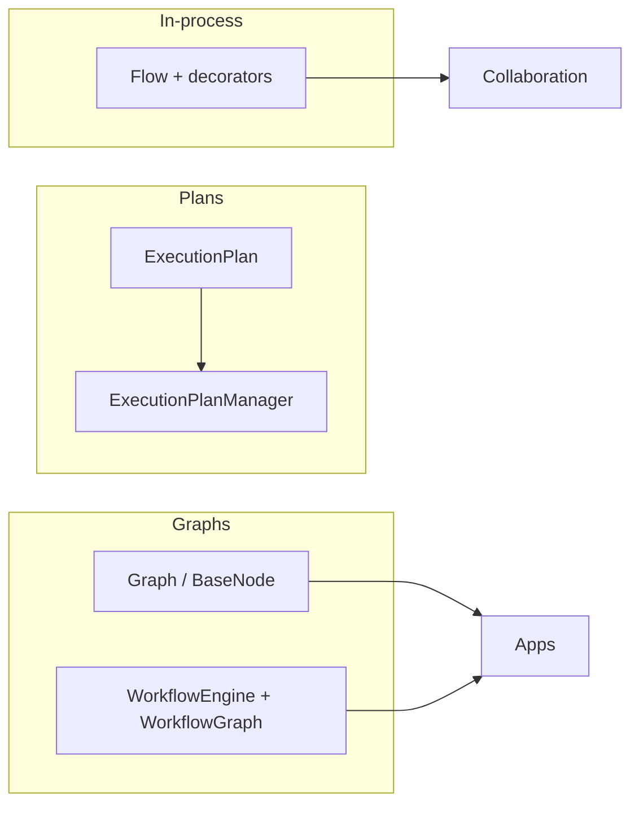
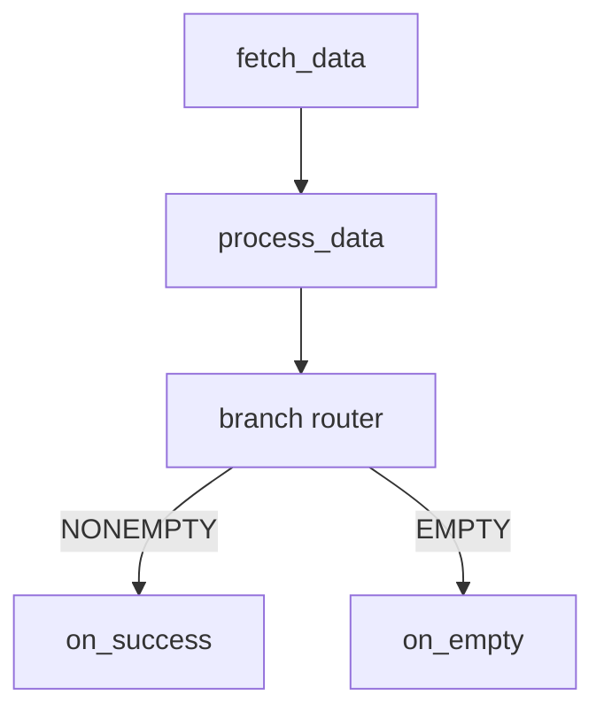
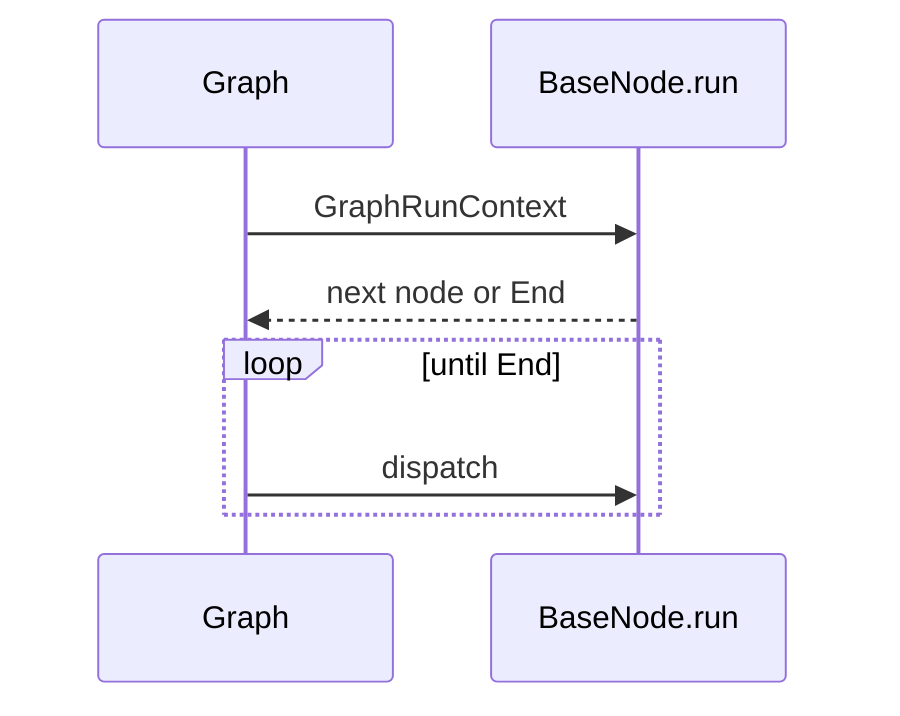

# Flow & Workflow Engine

AgenticX exposes two complementary ways to orchestrate multi-step logic: a **decorator-driven Flow system** for in-process method graphs, and a **configuration-driven `WorkflowEngine`** for graph-based execution of agents, tools, and tasks with event logging. A third lightweight **Graph** engine (`agenticx.core.graph`) targets typed async state machines; **ExecutionPlan** (Refly-inspired) adds explicit staged plans with human-in-the-loop controls.



---

## Overview

| Layer | Module / package | Best for |
|-------|------------------|----------|
| Flow | `agenticx.flow` | Python classes with `@start` / `@listen` / `@router`, shared mutable state |
| Execution plan | `agenticx.flow.execution_plan`, `execution_plan_manager` | Staged goals, subtasks, pause/resume, Mermaid export, persistence |
| Graph engine | `agenticx.core.graph` | Async nodes returning next node or `End`, edges from type hints |
| Workflow engine | `agenticx.core.workflow_engine` | `Workflow` / `WorkflowGraph`, concurrent branches, conditional edges, events |

!!! note "Package location"
    The Flow implementation lives under the **`agenticx/flow/`** directory (import as `agenticx.flow`). There is no separate `agenticx/core/flow/` tree; it is grouped here conceptually with other orchestration building blocks.

---

## Flow system

The Flow system is implemented in **`agenticx/flow/`** (`base.py`, `decorators.py`, `state.py`, `types.py`).

### `Flow` base class

- Generic over state type **`T`**, where `T` may be a plain **`dict`** or a **`pydantic.BaseModel`** (including subclasses of **`FlowState`**).
- At runtime, if no initial `state` is passed, the class tries to infer a default from `Flow[SomeState]`; `dict` becomes `{}`, Pydantic models get `SomeState()`.
- Entry points: **`kickoff()`** (sync, handles event-loop edge cases) and **`kickoff_async()`**.

### `FlowMeta` metaclass

On class creation, **`FlowMeta`** scans the namespace for flow methods and merges metadata from bases:

- **`_start_methods`**: ordered entry methods.
- **`_listeners`**: listener name → trigger condition (tuple or nested `FlowCondition` dict).
- **`_routers`**: methods that return string labels consumed by **`@listen`**.
- **`_router_paths`**: best-effort extraction of return constants from router source (regex).

### Decorators

| Decorator | Role |
|-----------|------|
| **`@start()`** | Unconditional entry, or conditional entry when combined with a trigger (string, `or_`/`and_`, or callable reference). |
| **`@listen(...)`** | Runs when its trigger condition becomes satisfied after upstream methods complete. |
| **`@router(...)`** | Runs after its trigger; **must return a `str`**; that string is recorded as a completed “virtual” method so **`@listen("LABEL")`** can fire. |

### `or_()` and `and_()`

- **`or_(*conditions)`** → `{"type": "OR", "conditions": [...]}` (any satisfied).
- **`and_(*conditions)`** → `{"type": "AND", "conditions": [...]}` (all satisfied).
- Arguments may be method names, nested condition dicts, or callables (name taken from `__name__`).

### `FlowState` and `FlowExecutionState`

- **`FlowState`**: optional Pydantic base for typed flow state; includes a default **`id`** field.
- **`FlowExecutionState`**: internal tracker for **`completed_methods`**, **`method_outputs`**, **`check_or_condition` / `check_and_condition`**, and run **`status`** (`pending`, `running`, `paused`, `completed`, `failed`). Exposed read-only on the flow via **`execution_state`**.

### Example: simple data pipeline

```python
from agenticx.flow import Flow, start, listen, router


class DataPipeline(Flow[dict]):
    @start()
    def fetch_data(self):
        return {"data": [1, 2, 3]}

    @listen("fetch_data")
    def process_data(self, result):
        # Single upstream output is passed as the `result` keyword argument.
        return {"processed": [x * 2 for x in result["data"]]}

    @router("process_data")
    def branch(self, result):
        values = result.get("processed", []) if isinstance(result, dict) else []
        return "NONEMPTY" if values else "EMPTY"

    @listen("NONEMPTY")
    def on_success(self):
        self.state["status"] = "ok"

    @listen("EMPTY")
    def on_empty(self):
        self.state["status"] = "empty"


flow = DataPipeline()
flow.kickoff()
```



---

## Execution plan (Refly-inspired)

Defined in **`agenticx/flow/execution_plan.py`**, with lifecycle and storage in **`agenticx/flow/execution_plan_manager.py`**. The design follows Refly’s ProgressPlan / pilot concepts (see module docstrings for file references).

### `ExecutionPlan`

| Field / concept | Description |
|-----------------|-------------|
| **`stages`** | List of **`ExecutionStage`** |
| **`current_stage_index`** | Index of the active stage |
| **`intervention_state`** | **`InterventionState`** for external control |
| **`goal`**, **`session_id`**, **`max_epochs`**, **`current_epoch`** | Planning metadata |
| **`overall_progress`** | Property: fraction of subtasks completed |

### `ExecutionStage` and `Subtask`

- **`ExecutionStage`**: name, optional description/objectives, **`subtasks`**, **`status`** (`StageStatus`: pending / active / done), **`progress`** property.
- **`Subtask`**: **`id`**, **`name`**, **`query`**, **`status`** (`SubtaskStatus`: pending / executing / completed / failed), result/error timestamps, **`reset()`**, **`mark_*`** helpers.

### `InterventionState`

| Value | Meaning |
|-------|---------|
| **`RUNNING`** | Normal execution |
| **`PAUSED`** | Stop after current subtask; executor should yield |
| **`RESUMING`** | Transition back into the plan-act loop |
| **`RESETTING`** | A subtask was reset via **`reset_node`** |

Call **`confirm_running()`** after handling **`RESUMING`** / **`RESETTING`** to return to **`RUNNING`**.

### `ExecutionPlanManager`

- **CRUD**: **`register`**, **`get`**, **`get_or_create`**, **`update`**, **`delete`**, **`list_sessions`**
- **Persistence**: **`persist`**, **`persist_all`**, **`load`**; optional **`auto_persist`** on updates
- **Storage backends** ( **`PlanStorageProtocol`** ): **`InMemoryPlanStorage`**, **`FilePlanStorage`** (default directory `.agenticx/plans`, one JSON file per `session_id`)
- **Events**: **`on(event_type, callback)`**, **`off`**, decorators **`on_plan_updated`**, **`on_plan_paused`**, **`on_plan_resumed`**; emits **`PlanEvent`** payloads
- **Helpers**: **`add_subtask_to_plan`**, **`delete_subtask_from_plan`**, **`update_subtask_status`**, **`pause_plan`**, **`resume_plan`**, **`reset_subtask`** (wraps **`ExecutionPlan.reset_node`**)

### Core capabilities

- **`ExecutionPlan.to_mermaid()`**: returns a **string** that includes a fenced `mermaid` code block (opening and closing triple backticks) plus stage/subtask nodes styled by status; suitable for pasting into Markdown.
- **`pause()` / `resume()` / `reset_node(subtask_id)`** on the plan model; manager mirrors pause/resume/reset with events and optional persistence.
- **Progress**: **`overall_progress`**, per-stage **`progress`**, **`to_execution_summary()`** for LLM-facing context during replanning.

!!! tip "Serialization"
    Use **`plan.to_dict()`** / **`ExecutionPlan.from_dict`** or Pydantic **`model_validate_json`** for round-tripping plans through storage or APIs.

---

## Graph engine

**Module:** `agenticx.core.graph`

Lightweight **async** graph execution inspired by **pydantic-graph** patterns: each node implements **`BaseNode.run(ctx) -> NextNode | End[T]`**, and **outgoing edges are inferred from the annotated return type** of `run` (unions of node classes and `End[...]`).

| Type | Role |
|------|------|
| **`GraphRunContext`** | Shared **`state`** and **`deps`** |
| **`End[T]`** | Terminal sentinel with **`result: T`** |
| **`Graph`** | Built from node **classes**; **`run(initial_node, state, deps)`** → **`GraphRunResult`** (result, steps, timing, **`node_history`**) |
| **`to_mermaid()`** | Edge list for documentation (no fences) |



---

## WorkflowEngine

**Module:** `agenticx.core.workflow_engine`

**`WorkflowEngine`** runs a **`Workflow`** model or a programmatic **`WorkflowGraph`**:

- **Graph construction**: **`WorkflowGraph.add_node`**, **`add_edge`**; optional **`condition`** callables on edges (stored on the graph instance).
- **Execution**: **`async run(workflow, initial_data=..., execution_id=...)`** validates the graph, starts from **entry nodes** (no incoming edges), then follows **`get_next_nodes`** after each node.
- **Concurrency**: entry nodes and downstream fan-out run via **`asyncio.gather`** with a **`Semaphore`** capped by **`max_concurrent_nodes`** (default 10).
- **Condition routing**: edges may encode JSON **`condition_config`**; runtime uses **`_edge_conditions`** when a Python **`condition`** was supplied.
- **Observability**: **`ExecutionContext`** holds **`event_log`** (`TaskStartEvent`, `TaskEndEvent`, `ErrorEvent`, etc.); human approval nodes emit **`HumanRequestEvent`** and set workflow status to **`PAUSED`**.

Statuses include **`WorkflowStatus`** (pending, running, paused, completed, failed, cancelled) and per-node **`NodeStatus`**.

---

## Orchestration patterns and collaboration

Higher-level **multi-agent orchestration** lives in **`agenticx.collaboration`** (`patterns.py`, `manager.py`, `config.py`). These patterns compose agents and executors; they are **conceptually aligned** with Flow / Workflow graphs but are **not** the same API.

| Pattern | Intent |
|---------|--------|
| **MasterSlave** | Master plans and delegates; slaves execute subtasks; results aggregated. |
| **Reflection** | Produce output, then critique/refine through explicit feedback loops. |
| **Debate** | Adversarial or multi-view discussion rounds → structured **`FinalDecision`**. |
| **GroupChat** | Shared conversational context among multiple agents. |
| **Parallel** | Concurrent subtasks or branches with aggregation. |
| **Nested** | Collaboration within collaboration (e.g., inner pattern instances). |
| **Dynamic** | Runtime adjustment of roles, tasks, or structure. |
| **Async** | Event-driven steps with **`AsyncEvent`**-style handling. |

Use **`CollaborationManager`** with **`CollaborationMode`** to select **`MasterSlavePattern`**, **`ReflectionPattern`**, etc. Combine with Flow or WorkflowEngine when you need **fine-grained in-code graphs** alongside **team-level collaboration**.

---

## Quick reference imports

```python
# Flow
from agenticx.flow import (
    Flow,
    FlowState,
    start,
    listen,
    router,
    or_,
    and_,
)

# Execution plan
from agenticx.flow import (
    ExecutionPlan,
    ExecutionStage,
    Subtask,
    InterventionState,
    ExecutionPlanManager,
    InMemoryPlanStorage,
    FilePlanStorage,
)

# Graph
from agenticx.core.graph import Graph, BaseNode, End, GraphRunContext

# Workflow
from agenticx.core.workflow_engine import WorkflowEngine, WorkflowGraph
```

---

## See also

- API reference: `api/flow.md`
- Multi-agent guide: `guides/multi-agent.md`
- Related concept page: `concepts/orchestration.md`
