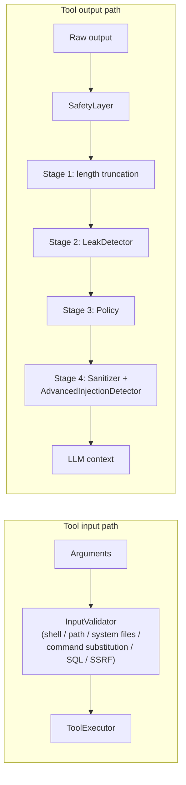

# Security: Safety Module

The AgenticX **Safety Module** is a defense-in-depth pipeline internalized from [IronClaw](https://github.com/nearai/ironclaw) (`nearai/ironclaw`, dual-licensed under **MIT OR Apache-2.0**). It separates **tool argument validation** (pre-execution) from **tool output hardening** (post-execution) before content reaches the model or user.

!!! danger "Defense in depth, not a guarantee"
    Automated pattern matching cannot cover every attack or every secret format. Treat this module as **risk reduction** alongside least-privilege tools, human review for high-risk actions, and secure deployment practices.

## Overview

Two logical paths:

| Path | When | Purpose |
|------|------|---------|
| **Input** | Before `ToolExecutor` runs a tool | Reject or flag LLM-produced arguments that encode shell abuse, traversal, SSRF toward private space, SQL abuse, or command substitution. |
| **Output** | After a tool returns (string results) | Bound size, detect secret leaks, enforce content policy, and reduce prompt-injection carryover into LLM context. |

`SafetyLayer` is the facade for the **output** pipeline and optionally drives **input** validation through the same `ToolExecutor` hook. `InputValidator` can also be used standalone.

## Architecture diagram



## SafetyLayer

`SafetyLayer` (`agenticx.safety.layer`) orchestrates output stages in a **fixed order**: truncation, leak handling, policy, then injection defense.

### SafetyConfig

| Field | Default | Role |
|-------|---------|------|
| `max_output_length` | `50000` | Hard cap on tool output length before a truncation suffix is applied. |
| `injection_check_enabled` | `True` | Run `Sanitizer` (and optional advanced detector). |
| `leak_detection_enabled` | `True` | Run `LeakDetector.scan` and apply redaction for `BLOCK`/`REDACT` matches. |
| `policy_check_enabled` | `True` | Run `Policy.check`; **blocking** replaces output when any rule with action `BLOCK` matches. |

### Constructor injection

All collaborators are optional; defaults are constructed if omitted:

- `leak_detector`, `sanitizer`, `policy`, `input_validator`, `audit_log`

This allows tests and deployments to swap implementations without forking the pipeline.

!!! note "Policy actions in the bundled pipeline"
    `Policy.check` returns all matched rules. In `sanitize_tool_output`, **only** `BLOCK` rules cause the tool string to be replaced with a suppression message. `WARN` and `SANITIZE` matches are available for logging or custom wrappers if you extend the flow.

### Key methods

| Method | Role |
|--------|------|
| `sanitize_tool_output(output, tool_name)` | Full output pipeline. |
| `validate_tool_input(tool_name, args)` | Delegates to `InputValidator.validate`. |
| `wrap_for_llm(content, source)` / `wrap_external_content(content)` | XML-style boundaries via `Sanitizer`. |

## Input validation

`InputValidator` recursively flattens `dict` / `list` argument trees via `_flatten_args`, producing `(param_path, string_value)` pairs for regex scanning.

### Built-in rules

| Rule ID | Risk | Blocking | Summary |
|---------|------|----------|---------|
| `shell_injection` | CRITICAL | Yes | Chained dangerous shell patterns (e.g. `rm -rf`, `curl \| sh`). |
| `path_traversal` | CRITICAL | Yes | Repeated `../` sequences. |
| `system_file_ref` | CRITICAL | Yes | References to sensitive paths (`/etc/passwd`, `.ssh`, `.aws/credentials`, `.gnupg/`, etc.). |
| `command_substitution` | HIGH | Yes | `$(...)` or backtick command substitution. |
| `sql_injection` | MEDIUM | No | Classic SQLi motifs (`DROP TABLE`, `UNION SELECT`, `OR 1=1`, etc.). |
| `ssrf_private_ip` | HIGH | Yes | Private / loopback IP literals in URL-like forms. |

### Extension points

- **`extra_rules`**: Additional tuples `(rule_id, description, pattern, InputRiskLevel, blocking)` compiled at init.
- **`tool_policies`**: Per-tool `ToolInputPolicy` (elevated baseline risk, extra blocked patterns).

`InputValidationResult.is_blocked` is true if **any** violation has `is_blocking=True`.

## Leak detection

`LeakDetector` matches **17** built-in secret-style patterns. Matching uses regex validation; when `pyahocorasick` is installed, a **prefix / Aho-Corasick** index narrows candidate patterns on large inputs.

### Built-in patterns by action

**BLOCK (12)**

| Pattern name | Notes |
|--------------|--------|
| `openai_api_key` | `sk-` / `sk-proj-` style keys |
| `anthropic_api_key` | `sk-ant-apiNN-` |
| `aws_access_key` | `AKIA…` |
| `github_token` | `ghp_` / `ghs_` |
| `github_fine_grained` | `github_pat_` |
| `stripe_key` | `sk_live_` / `sk_test_` |
| `slack_token` | `xoxb-` / `xoxp-` / etc. |
| `slack_webhook` | `hooks.slack.com/services/…` |
| `private_key_pem` | PEM private key headers |
| `ssh_private_key` | OpenSSH / EC / DSA private key blocks |
| `gcp_service_account` | JSON `service_account` marker |
| `azure_connection_string` | Account key in connection string |

**REDACT (2)**

| Pattern name | Notes |
|--------------|--------|
| `bearer_token` | `Bearer …` |
| `authorization_basic` | `Basic …` |

**WARN (3)**

| Pattern name | Notes |
|--------------|--------|
| `generic_api_key_param` | `api_key=` / `apikey:` style |
| `password_param` | `password=` style |
| `high_entropy_hex` | Long hex runs (low severity) |

### APIs

| API | Behavior |
|-----|----------|
| `scan(content)` | Returns `LeakScanResult` with matches and optional `redacted_content`. |
| `scan_and_clean(content)` | Returns string; **BLOCK** and **REDACT** regions replaced; **WARN** left in place. |
| `scan_and_block(content)` | Raises `SecretLeakError` if any **BLOCK** match exists. |

### Dynamic rules

- `add_pattern(LeakPattern)` — append and rebuild the prefix index.
- `remove_pattern(name)` — drop by `pattern.name` and rebuild.

## Policy engine

`Policy` evaluates ordered `PolicyRule` entries (regex match anywhere in content).

### Built-in rules

**BLOCK (3)**

| ID | Severity | Description |
|----|----------|---------------|
| `system_file_access` | CRITICAL | System / cloud credential path motifs |
| `crypto_private_key` | CRITICAL | PEM private key blocks |
| `shell_injection` | CRITICAL | Shell pipeline abuse patterns |

**WARN (2)**

| ID | Severity | Description |
|----|----------|---------------|
| `sql_pattern` | MEDIUM | SQLi-style fragments |
| `excessive_urls` | LOW | Many URLs in one blob |

**SANITIZE (1)**

| ID | Severity | Description |
|----|----------|---------------|
| `encoded_exploit` | MEDIUM | Encoded execution motifs (e.g. `base64_decode`, `eval(base64`) |

### Dynamic rules

- `add_rule(PolicyRule)`
- `remove_rule(rule_id)`

## Injection defense (Sanitizer)

`Sanitizer` applies **9** regex-based injection heuristics (severity per pattern), then optional **Level 2** `AdvancedInjectionDetector`.

### Built-in injection patterns (severity)

| Severity | Count | Examples (paraphrased) |
|----------|-------|-------------------------|
| CRITICAL | 4 | Ignore/forget/disregard prior instructions |
| HIGH | 3 | Role manipulation, fake role headers (`system:` / `user:` / `assistant:`), anti-rule phrases |
| MEDIUM | 2 | Prompt extraction, `eval`/`exec`, `base64_decode` / `atob` |

### Escaping and wrapping

- **`_escape_content`**: HTML-entity encodes **11** dangerous model tokens (e.g. `<|im_start|>`, `[INST]`, `<<SYS>>`, etc.) and neutralizes leading `system|user|assistant:` lines; strips NUL.
- **`wrap_for_llm`**: Wraps payload in `<tool_output source="…">…</tool_output>` with closing-tag escape.
- **Optional Level 2**: If `advanced_detector` is set and `analyze().risk_score > 0.5`, runs `normalize` then `_escape_content` again and adds high-severity warnings.

## Advanced injection detection

`AdvancedInjectionDetector` (optional) scores obfuscation-heavy content into **`risk_score` ∈ [0.0, 1.0]**.

| Technique | Implementation summary |
|-----------|---------------------------|
| Zero-width | **9** code points stripped / counted (ZWSP, ZWNJ, ZWJ, directional marks, BOM, soft hyphen, word joiner, Mongolian vowel separator, etc.). |
| Unicode confusables | **20** Cyrillic→Latin lookalike mappings (e.g. `а`→`a`, `О`→`O`) for detection and `normalize()`. |
| Shannon entropy | Sliding window (**64** chars, step **half-window**); flag when per-character entropy **> 4.5** bits (configurable). |
| `normalize()` | Drop zero-width; map confusables to Latin. |

## Sandbox policy

`SandboxPolicy` maps **inferred or declared** tool risk to a **recommended** backend and timeout. It does **not** spawn containers by itself; it pairs with your executor / sandbox implementation.

| Risk | Backend | Network | `max_timeout` (s) |
|------|---------|---------|-------------------|
| CRITICAL | `docker` | disabled | 60 |
| HIGH | `docker` | disabled | 120 |
| MEDIUM | `subprocess` | enabled | 300 |
| LOW | `None` | enabled | 600 |

**Per-tool profiles**: `ToolRiskProfile(tool_name, risk_level, force_backend?, network_enabled, max_timeout)` in `SandboxPolicy(tool_profiles=[...])`. If no profile exists, risk is inferred from tool name keywords (`shell`, `curl`, `file`, …).

## Audit logging

`SafetyAuditLog` stores `SafetyEvent` records in a **`deque`** ring buffer (`maxlen` = `max_events`, default **1000**).

### SafetyStage (5 values)

| Stage | Typical trigger |
|-------|-----------------|
| `TRUNCATION` | Output length cap |
| `LEAK_DETECTION` | Secret patterns |
| `POLICY_CHECK` | Policy rule match |
| `INJECTION_DEFENSE` | Sanitizer / advanced path |
| `INPUT_VALIDATION` | Argument validator |

### Query and stats

- `query(tool_name=?, stage=?, severity=?)` — multi-filter on the buffer.
- `stats()` — aggregates `total_events`, `by_tool`, `by_stage`, `by_severity`.

Attach the log to `SafetyLayer(..., audit_log=log)` so `_emit` records pipeline actions.

## Integration examples

### SafetyLayer with ToolExecutor

`ToolExecutor` calls `validate_tool_input` before execution and `sanitize_tool_output` on string results when `safety_layer` is set.

```python
from agenticx.safety import SafetyLayer, SafetyConfig, SafetyAuditLog
from agenticx.tools.executor import ToolExecutor

audit = SafetyAuditLog(max_events=500)
safety = SafetyLayer(
    config=SafetyConfig(max_output_length=50_000),
    audit_log=audit,
)
executor = ToolExecutor(safety_layer=safety)

# result = executor.execute(my_tool, **args)
```

### SandboxPolicy standalone

```python
from agenticx.safety import SandboxPolicy, ToolRiskProfile, RiskLevel

policy = SandboxPolicy(
    tool_profiles=[
        ToolRiskProfile("run_shell", risk_level=RiskLevel.CRITICAL, network_enabled=False),
    ],
)
rec = policy.recommend("run_shell")
# rec.backend, rec.network_enabled, rec.max_timeout
```

## Dynamic rule management

`LeakDetector.add_pattern` / `remove_pattern` and `Policy.add_rule` / `remove_rule` mutate live rule sets **without restarting** the process. After changes, the next `scan` or `check` uses the updated rules. Rebuild-bound structures (leak prefix index) run inside those mutators.

!!! warning "Concurrency"
    If multiple threads share one detector or policy instance, serialize mutations or use per-task copies to avoid races during list rebuilds.

## See also

- Package entry: `agenticx.safety`
- Tests: `tests/test_safety_*.py` for behavior contracts
