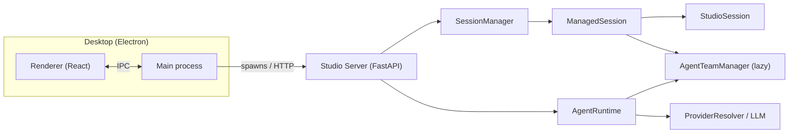

# Studio Server & Session Management

## Overview

**Studio** is the backend service layer for **AgenticX Desktop**. It exposes a **FastAPI** application with **Server-Sent Events (SSE)** streaming endpoints so the Electron renderer can drive multi-turn chat, tool execution, confirmations, avatars, and group routing without blocking HTTP responses.

The implementation lives in `agenticx/studio/server.py` (`create_studio_app()`). Long-lived chat turns are modeled as `text/event-stream` responses where each line is a JSON payload describing runtime progress (tokens, tool calls, errors, sub-agent state, and so on).

!!! note "CLI naming"
    The **HTTP server** is started with **`agenticx serve`** (or the `agx serve` entrypoint). The **`agenticx studio`** command launches the **interactive terminal Studio** (REPL-style UI), not the FastAPI process.

---

## Architecture

Desktop loads the web UI inside Electron. The renderer obtains the API base URL from the main process, which typically spawns the Python server as a child process. `SessionManager` owns per-session state (`ManagedSession`); each session wraps a `StudioSession` dataclass and optional `AgentTeamManager` for sub-agents. Chat requests are executed by **`AgentRuntime`** (`agenticx/runtime/agent_runtime.py`), which emits **`RuntimeEvent`** values that the HTTP layer serializes into SSE frames.



!!! tip "Authentication header"
    When `AGX_DESKTOP_TOKEN` is set in the server environment, clients must send the same value in the **`X-Agx-Desktop-Token`** header. Some administrative routes (MCP listing/import/connect, taskspace APIs, email test) **require** this token even when global auth is disabled.

---

## Starting the Server

Start the Studio HTTP API from the project virtualenv:

```bash
agenticx serve --host 127.0.0.1 --port 7899
```

Equivalent shorthand (if your install exposes the `agx` console script):

```bash
agx serve --host 127.0.0.1 --port 7899
```

| Setting | Typer defaults (`agenticx serve`) | Typical Desktop spawn |
| --- | --- | --- |
| Host | `0.0.0.0` | `127.0.0.1` |
| Port | `8000` | Ephemeral port chosen by the main process |

!!! info "`AGX_STUDIO_HOST` / `AGX_STUDIO_PORT`"
    The **`serve`** command reads **`--host`** and **`--port`** only. Environment variables named `AGX_STUDIO_HOST` and `AGX_STUDIO_PORT` are **not** consumed by the server today. For a fixed local setup such as **`127.0.0.1:7899`**, pass them explicitly on the command line or wrap `agenticx serve` in a shell script that expands your own variables.

Optional development reload:

```bash
agenticx serve --host 127.0.0.1 --port 7899 --reload
```

---

## Session Management

### `ManagedSession` fields

`ManagedSession` (`agenticx/studio/session_manager.py`) is the server-side handle for one chat session.

| Field | Description |
| --- | --- |
| `session_id` | Stable UUID string; directory name under `~/.agenticx/sessions/`. |
| `studio_session` | `StudioSession` holding provider/model, `chat_history`, `agent_messages`, artifacts, MCP state, scratchpad, etc. |
| `confirm_gate` | `AsyncConfirmGate` for the Meta-Agent (`agent_id` `"meta"`). |
| `sub_confirm_gates` | Per sub-agent confirm gates; lazily created via `get_confirm_gate(agent_id)`. |
| `team_manager` | `AgentTeamManager` or `None` until `get_or_create_team()` runs. |
| `updated_at` / `created_at` | Unix timestamps for TTL and sorting. |
| `avatar_id` / `avatar_name` | Optional avatar binding for direct-avatar sessions or `group:<id>`. |
| `session_name` | User-visible title; **auto-title** uses the first user message truncated to **30 characters** (whitespace-normalized). |
| `pinned` | Boolean; affects `list_sessions` ordering. |
| `archived` | Boolean; archived sessions are hidden from default listing. |
| `taskspaces` | List of `{id, label, path}` maps; **at most 5** entries (`SessionManager.max_taskspaces`). |

### Persistence layout

| Store | Role |
| --- | --- |
| **`SessionStore` (SQLite)** | Todos, scratchpad, session summary text, and **metadata** (provider, model, `session_name`, `avatar_id`, `pinned`, `archived`, `taskspaces`, timestamps). |
| **`~/.agenticx/sessions/<session_id>/messages.json`** | Full `chat_history` snapshot (normalized roles, attachments, etc.). |
| **`~/.agenticx/sessions/<session_id>/agent_messages.json`** | Last **40** agent-context messages only (`tail` on save). |
| **`~/.agenticx/sessions/<session_id>/context_files_refs.json`** | JSON list of **absolute file paths** referenced by `context_files`; contents are re-read on restore. |

### Restore flow (cold start)

When `SessionManager.create()` loads an existing `session_id`, `_restore_persisted_state()` runs in this order:

1. **SessionStore** — restore todos and scratchpad into `StudioSession`.
2. **`messages.json`** — load and `_normalize_messages` into `chat_history`.
3. **`agent_messages.json`** — load and pass through **`_sanitize_context_messages`** (`agenticx/runtime/agent_runtime.py`) into `agent_messages`.
4. **`context_files_refs.json`** — for each path that still exists on disk, read UTF-8 text into `context_files`.

Metadata such as `session_name`, pins, archive flags, and taskspaces is applied separately via `_restore_managed_metadata()`.

### CRUD and lifecycle operations

| Operation | Behavior |
| --- | --- |
| **create** | `SessionManager.create()` builds `ManagedSession`, restores persistence if present, ensures default taskspace, registers in `_sessions`. |
| **get** | Returns in-memory session or **materializes** from persistence when `messages.json` or DB metadata exists. |
| **persist** | Writes todos, scratchpad, summary + metadata to **SessionStore**, snapshots `messages.json` / `agent_messages.json` / context refs. |
| **delete** | Shuts down `team_manager` if needed; purges **SQLite row**, removes **`~/.agenticx/sessions/<id>`**, removes **`~/.agenticx/taskspaces/<id>`** default tree when present. |
| **fork_session** | New UUID session copying provider/model, workspace dir, `chat_history`, `agent_messages`, `context_files`, scratchpad, artifacts; name suffix **`(Fork)`**. |
| **archive_sessions_before** | For same `avatar_id`, marks older sessions `archived` based on `updated_at`. |
| **rename** / **pin** | Updates `ManagedSession` fields and persists. |
| **auto_title_session** | Sets `session_name` from first user text (30 chars) only if still empty. |
| **list_sessions** | Merges live `_sessions` with `SessionStore` and orphan directories that contain `messages.json`; sorts pinned first, then `updated_at`. |
| **cleanup_expired** | For sessions idle longer than **`ttl_seconds`** (default **3600**), evicts from memory after persisting and shuts down `team_manager`. |

---

## Taskspace Management

- Each session may register **up to five** taskspaces (`max_taskspaces = 5`).
- If none are configured, `_ensure_default_taskspace()` injects one entry with **`id: "default"`**, label **`默认工作区`**, and path:

  `~/.agenticx/taskspaces/<session_id>/default`

- Adding a taskspace resolves the path (creates directories), deduplicates by path, and persists metadata.

### HTTP API (requires desktop token)

All routes below use **`_check_mcp_admin_token`**: set **`AGX_DESKTOP_TOKEN`** and send **`X-Agx-Desktop-Token`**.

| Route | Method | Description |
| --- | --- | --- |
| `/api/taskspace/workspaces` | `GET` | `session_id` query — list taskspaces for the session. |
| `/api/taskspace/workspaces` | `POST` | JSON body: `session_id`, optional `path`, optional `label` — add or return existing path. |
| `/api/taskspace/workspaces` | `DELETE` | JSON body: `session_id`, `taskspace_id` — remove; default taskspace is re-created if list becomes empty. |
| `/api/taskspace/files` | `GET` | Query: `session_id`, `taskspace_id`, optional `path` — non-recursive directory listing under the taskspace root. |
| `/api/taskspace/file` | `GET` | Query: `session_id`, `taskspace_id`, `path` — read a file (UTF-8, max **512 KiB** per request; `truncated` flag when cut). |

Path traversal outside the taskspace root is rejected (`path escapes taskspace root`).

---

## API Reference

Tables list routes registered on the Studio app. Unless noted, protected routes expect **`X-Agx-Desktop-Token`** when `AGX_DESKTOP_TOKEN` is set.

### Chat & execution

| Route | Method | Description |
| --- | --- | --- |
| `/api/chat` | `POST` | Main chat turn; returns **SSE** (`text/event-stream`). |
| `/api/loop` | `POST` | `LoopController` multi-iteration run; **SSE** stream. |
| `/api/confirm` | `POST` | Resolve a pending `AsyncConfirmGate` request (`session_id`, `request_id`, `approved`, `agent_id`). |

### Session management

| Route | Method | Description |
| --- | --- | --- |
| `/api/session` | `GET` | Get or create session; optional `session_id`, `provider`, `model`, `avatar_id`. Runs `cleanup_expired`, bootstraps workspace. |
| `/api/session/messages` | `GET` | Normalized message list for `session_id`. |
| `/api/session/summary` | `POST` | Built-in text summary from recent chat + todos. |
| `/api/session` | `DELETE` | Delete session (LSP shutdown, purge persistence). |
| `/api/artifacts` | `GET` | Map of artifact paths to in-memory content. |
| `/api/sessions` | `GET` | List sessions (`avatar_id` filter optional). |
| `/api/sessions` | `POST` | Create session; supports `name`, `avatar_id`, `inherit_from_session_id`. |
| `/api/sessions/{session_id}` | `PUT` | Rename session (`name` body field). |
| `/api/sessions/{session_id}/pin` | `POST` | Set `pinned` boolean. |
| `/api/sessions/{session_id}/fork` | `POST` | Fork session. |
| `/api/sessions/archive-before` | `POST` | Archive older same-avatar sessions. |
| `/api/sessions/batch-delete` | `POST` | Delete many sessions (`session_ids` list). |

### Taskspace

| Route | Method | Description |
| --- | --- | --- |
| `/api/taskspace/workspaces` | `GET` / `POST` / `DELETE` | List, add, or remove taskspaces (**admin token**). |
| `/api/taskspace/files` | `GET` | List files in a taskspace directory (**admin token**). |
| `/api/taskspace/file` | `GET` | Read file content (**admin token**). |

### Avatar & group

| Route | Method | Description |
| --- | --- | --- |
| `/api/avatars` | `GET` | List avatar definitions. |
| `/api/avatars` | `POST` | Create avatar. |
| `/api/avatars/{avatar_id}` | `PUT` | Update avatar. |
| `/api/avatars/{avatar_id}` | `DELETE` | Delete avatar. |
| `/api/avatars/fork` | `POST` | Fork avatar configuration. |
| `/api/avatars/generate` | `POST` | LLM generates `name` / `role` / `system_prompt` JSON from `description`, then creates an avatar (`created_by: ai`). |
| `/api/groups` | `GET` / `POST` | List or create group chats. |
| `/api/groups/{group_id}` | `PUT` / `DELETE` | Update or delete group. |
| `/api/subagent/cancel` | `POST` | Cancel a running sub-agent. |
| `/api/subagent/retry` | `POST` | Retry sub-agent with optional new task text. |
| `/api/subagents/status` | `GET` | Status rows; falls back to global registry / delegation info when needed. |

### Configuration & MCP

| Route | Method | Description |
| --- | --- | --- |
| `/api/mcp/servers` | `GET` | List configured MCP servers and connection flags (**admin token**). |
| `/api/mcp/import` | `POST` | Import MCP config from `source_path` (**admin token**). |
| `/api/mcp/connect` | `POST` | Connect one server by `name` (**admin token**). |
| `/api/test-email` | `POST` | Send SMTP test message (**admin token**). |

### Other

| Route | Method | Description |
| --- | --- | --- |
| `/api/memory/save` | `POST` | Append `content` to session scratchpad `saved_messages` (capped at 200) and persist. |
| `/api/messages/forward` | `POST` | Merge selected messages into `target_session_id` as a user bubble with `forwarded_history`; mirrors into `agent_messages`. |

---

## SSE Streaming Protocol

- **Endpoint:** `POST /api/chat`
- **Response:** `Content-Type: text/event-stream`
- **Frame format:** one SSE **data** line per event, UTF-8 JSON.

Each JSON object follows the `SseEvent` model (`agenticx/studio/protocols.py`):

```json
{"type": "<event_type>", "data": { "...": "..." }}
```

The server copies `RuntimeEvent.agent_id` into **`data["agent_id"]`** when missing so clients can attribute tokens, tools, and sub-agent traffic.

### Terminal frame

Every stream ends with a **done** sentinel (exact payload may vary slightly by code path):

```json
{"type": "done", "data": {}}
```

### Branching logic inside `/api/chat`

1. **`agent_id != "meta"`** — Sub-agent follow-up: wires `TeamManager.event_emitter` to a queue, sends user text via `send_message_to_subagent`, streams filtered `RuntimeEvent`s until completion or error, then `done`.
2. **Group session** (`avatar_id` like `group:<id>` or resolved group payload) — `GroupChatRouter.run_group_turn` emits `group_typing`, `group_reply`, `group_skipped`, `error`, etc., then persists and sends `done`.
3. **Default Meta / avatar-direct** — Builds `AgentRuntime`, chooses **`META_AGENT_TOOLS`** vs avatar-stripped tool list, runs `runtime.run_turn`, forwards events as `SseEvent`, flushes optional taskspace hints from scratchpad, persists, then `done`.

`POST /api/loop` uses the same **`SseEvent`** JSON encoding for `LoopController` events.

---

## Workspace Context

Meta-Agent system prompts incorporate files under the configured workspace directory (default **`~/.agenticx/workspace/`**), resolved by `resolve_workspace_dir()` in `agenticx/workspace/loader.py`.

`load_workspace_context()` returns a dictionary with:

| Key | Source file |
| --- | --- |
| `identity` | `IDENTITY.md` |
| `user` | `USER.md` |
| `soul` | `SOUL.md` |
| `memory` | `MEMORY.md` |
| `daily_memory` | `memory/<YYYY-MM-DD>.md` (today’s date) |
| `workspace_dir` | Absolute workspace path string |

`ensure_workspace()` creates missing files and today’s daily memory stub. The Studio server calls `ensure_workspace()` when opening a session so first-run machines get a consistent tree before chat.

```python
from agenticx.workspace.loader import load_workspace_context

ctx = load_workspace_context()
# ctx["identity"], ctx["user"], ctx["soul"], ctx["memory"], ctx["daily_memory"]
```

This loader is used when building Meta-Agent prompts (`agenticx/runtime/prompts/meta_agent.py` imports `load_workspace_context`).

---

## See also

- `agenticx/studio/server.py` — route definitions and SSE adapters
- `agenticx/studio/session_manager.py` — persistence and taskspaces
- `agenticx/cli/main.py` — `serve` Typer command
- `agenticx/workspace/loader.py` — workspace bootstrap and `load_workspace_context()`
