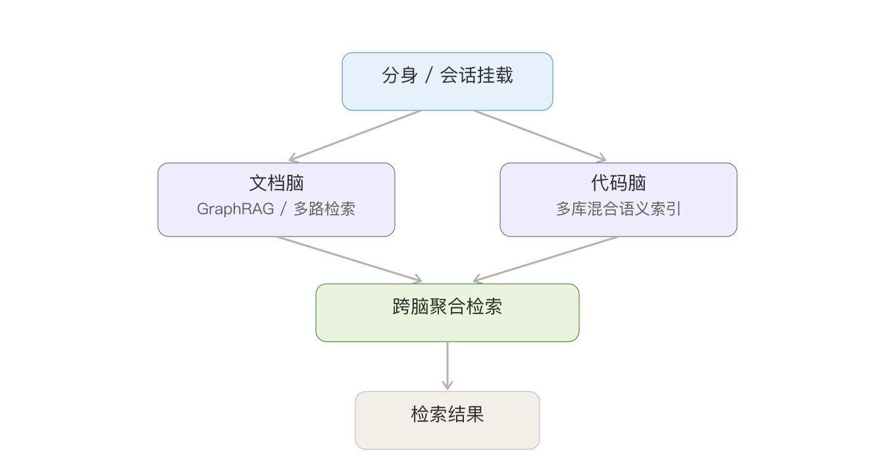
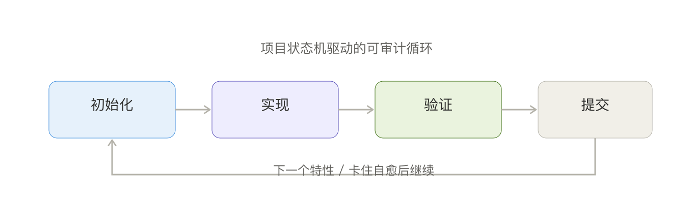

# AgenticX 核心技术解析

本文承接《AgenticX 项目介绍》，面向有技术背景的读者，逐项拆解 AgenticX 在工程上做对了哪些关键决策，以及这些决策为什么重要。

## 一、统一的核心抽象

AgenticX 的第一块基石是一套自洽的核心抽象：智能体、任务、工具、工作流、事件总线，以及统一的数据契约。所有数据契约都基于 Pydantic 定义，类型在编译期和运行期都受到约束。

这件事看起来朴素，价值却很大。当智能体、任务和工具的语义被固定下来之后，团队不再需要为每个项目重新约定接口，沉淀的代码也能在不同场景间复用。整个框架的扩展，本质上都是在这套抽象之上做组合，而不是各搭各的。

## 二、智能体核心与执行引擎

智能体核心基于 ，论构建，采用 think-act 循环和事件驱动架构，内置自修复和上下文溢出恢复。所谓自修复，是指当模型产生了不合法的工具调用序列时，运行时会自动清洗上下文、补齐断链，避免把脏数据原样抛给模型导致整轮失败。

框架同时提供两种使用形态。一种是可嵌入的 ReActAgent，它是一个规范的异步函数调用 ReAct 循环，对外暴露 ainvoke 和 astream 两个入口，配有类型化的事件流、多轮历史进出和并行工具执行，并且可以按需注入循环检测器、上下文压缩器和卸载器。它与 Studio 和 CLI 完全解耦，适合直接嵌进别的系统。另一种是面向完整产品的运行时，承载会话管理、调度和协作。两者共享同一套核心组件，区别只在使用边界。

## 三、Meta-Agent 与多智能体协作

多智能体协作是 AgenticX 最有特色的部分。它采用一个充当总调度的 Meta-Agent，类似项目里的项目经理：用户的请求先到它这里，它判断该由哪个分身来做，再把任务真正委派下去，在子智能体的独立会话中执行，全过程的历史和产出都可追溯。

这里有几个工程上的讲究。委派是"真委派"，任务在分身自己的会话里跑，而不是用一个影子进程顶替身份；团队管理带有并发上限、归档快照和按会话的隔离，避免不同任务互相串扰;群聊支持用户指定、智能路由和轮流回复等多种策略，用户既可以点名某个分身，也可以让 Meta-Agent 兜底统筹。

## 四、记忆系统

记忆是智能体能否"越用越懂你"的关键。AgenticX 的记忆分为核心、情景、语义三层，深度集成了 Mem0，并补充了工作区记忆和短期记忆。它还做了几件别的框架少做的事：记忆衰减让旧信息随时间自然淡出，混合搜索把向量检索和关键词检索结合起来提升召回，压缩刷写则在上下文逼近上限时把历史压缩归档，腾出空间继续对话。

## 五、工具系统与通信协议

工具系统提供统一接口，一个函数加上装饰器就能变成智能体可调用的工具。在此之上，它集成了 MCP Hub 做多服务聚合，支持远程工具、OpenAPI 工具集和沙箱工具，并能把技能打包成可复用的技能包。

为了让大体积的工具结果不撑爆上下文，框架引入了统一卸载机制：通过 Offloader 协议和文件后端，把大块返回值或压缩后的上下文移出实时历史，只在原地留一个引用占位符，需要时再按需取回。配套还有一个在沙箱内运行 MCP server 的网关。

通信层面，A2A 协议负责智能体之间的互通，包含客户端、服务端、AgentCard 和"技能即工具"的设计；MCP 协议则负责标准化的工具和资源访问。

## 六、模型接入层

模型接入层覆盖十五家以上供应商，OpenAI、Anthropic、Ollama、Gemini、Kimi、MiniMax、火山引擎、智谱、千帆、百炼等都已接入。它在上层统一了调用方式，并补齐了三个实用能力：响应缓存减少重复调用的开销，转录清洗保证传给模型的对话序列合法，故障转移路由在某个供应商不可用时自动切换。对不支持图片输入或特定参数的模型，框架会在前端和服务端做相应拦截和兼容，避免直接报错。

## 七、知识与检索

知识系统提供从文档解析到知识图谱构建的完整流水线，含分块器、读取器、抽取器和图构建器，检索侧支持向量、BM25、图、混合、自动检索和重排序。

其中比较独特的是多脑架构。框架把知识库拆成可隔离、可按分身或会话挂载的"文档脑"和"代码脑"，并支持跨脑聚合检索。

代码脑背后是一套多代码库的混合语义索引，把向量检索和 BM25 结合起来，让智能体能在多个仓库之间做语义级的代码查找。这套设计让同一个智能体平台能服务不同知识边界的用户，而不会互相污染。

## 八、技能与自进化

技能系统不只是注册和调用，而是一套完整的生命周期管理。每个技能在落地前要经过危险模式安全扫描门禁，修补技能时用五种策略的模糊匹配链来定位代码，所有变更写入独立的变更日志，技能还带有来源标注，可按单个技能粒度启停。

更进一步的是自进化。框架会在运行时采集每一次工具调用的观察数据，在复杂会话结束后由后台的大模型复盘，自动把有效经验沉淀成新技能。质量门禁、使用统计和低效淘汰共同构成一个闭环，让技能库随使用不断优化，而不是一成不变。

## 九、长周期自主编码

一般的智能体回答完一个问题就结束了，AgenticX 想做的是让它围绕一个工程目标长期运转。长周期编排会轮询多个任务来源，包括手动队列、定时任务和项目特性，为每个任务分配隔离的工作区，并在任务卡住时自我修复，在继续和失败两条路径上分别做退避。

支撑它的是一个磁盘持久化的项目状态机，作为唯一可信来源，配合文件锁和原子写，驱动一个"初始化、实现、验证、提交"的可审计循环。这让智能体的长跑过程不再是黑盒，而是每一步都有据可查。

## 十、企业安全与沙箱

安全在 AgenticX 里是和功能并列的一等公民。安全层包含泄露检测、输入清洗、注入攻击识别、策略引擎和输入校验，策略引擎支持基于规则、严重级别和动作的组合。所有代码执行都进沙箱，沙箱提供 Docker、Microsandbox、子进程和远程 HTTP 多种后端，由分级工厂自动选择，并把每次执行写入审计日志。会话层面则做了数据库持久化、写锁和按租户的多租户隔离。

## 十一、可观测性与评测

可观测性包含完整的回调体系、实时指标、轨迹分析和调用树，并对接 Prometheus 和 OpenTelemetry，支持通过 WebSocket 流式输出。评测侧提供基于 EvalSet 的框架，含大模型裁判、复合裁判、轨迹匹配器和把追踪数据转成评测集的转换器。这两块合在一起，让团队既能在线上看清智能体的真实行为，也能在迭代时量化它的表现。

## 十二、存储层

存储层把四类后端统一接入：键值类支持 SQLite、Redis、PostgreSQL、MongoDB，向量类支持 Milvus、Qdrant、Chroma、Faiss、PgVector、Pinecone、Weaviate，图类支持 Neo4j 和 Nebula，对象类支持 S3、GCS、Azure。上层用统一的存储路由屏蔽差异，并支持迁移。这正是"可插拔、不绑定供应商"理念在存储层的具体落地。

## 十三、小结

把这些技术放在一起看，会发现它们指向同一个目标：让多智能体系统真正可用、可控、可演进。统一抽象解决"乱"，可插拔解决"绑"，安全与可观测解决"不敢上线"，自进化与长周期自主则在解决"智能体能不能走得更远"。这是 AgenticX 在工程上的整体取向。