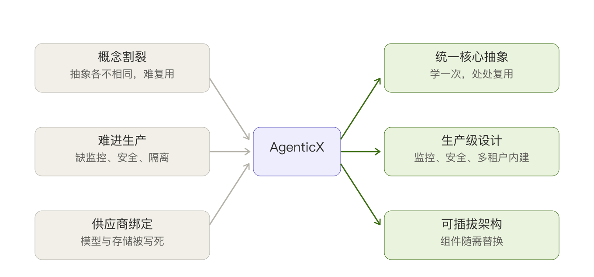
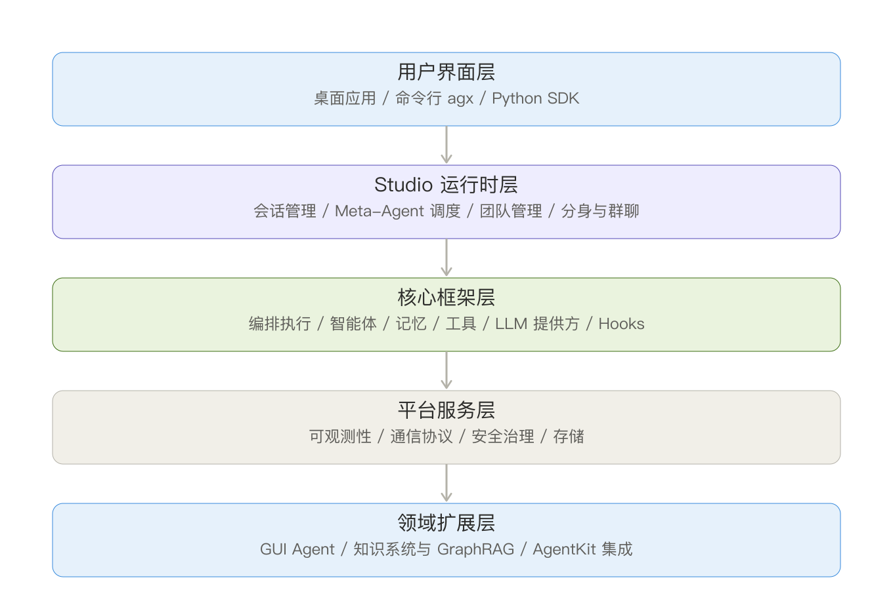
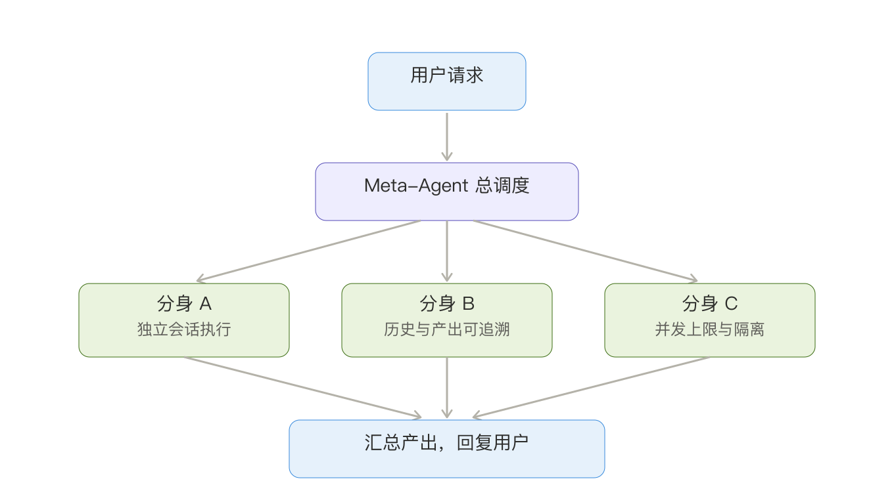

# AgenticX 项目介绍

## 一、它是什么

AgenticX 是一套统一、可扩展、可直接用于生产的多智能体应用开发框架。一句话概括：它让开发者在同一套抽象之上，既能搭出一个简单的自动化小助手，也能搭出一个由多个智能体分工协作、能长期自主运转的复杂系统。

框架本身用 Python 编写，核心包保持轻量，只依赖二十多个基础库，安装在几秒内完成；记忆、知识图谱、文档解析、OCR、可观测性等重型能力按需以可选组件的方式加载。配套还提供命令行工具 agx、基于 FastAPI 的管理服务 Studio，以及一个 Electron + React 的桌面客户端，对应从脚本开发者到终端用户的不同人群。

## 二、为什么要做这件事

过去两年，智能体相关的开源项目层出不穷，但真正落地时普遍会遇到三类问题。

第一类是概念割裂。不同框架对"智能体""任务""工具""记忆"的定义各不相同，团队在选型和迁移时要反复重学，沉淀下来的代码很难复用。

第二类是难以进入生产。很多框架能跑通 demo，却缺少企业真正需要的东西：完整的可观测性、安全合规、多租户隔离、稳定的故障恢复。一旦上线，问题排查无从下手。

第三类是被供应商绑定。模型、向量库、存储后端往往被写死，换一家厂商就要大改代码。

AgenticX 的出发点，就是把这三件事一次性解决：给出一套清晰一致的核心抽象，让所有组件都可替换，并且从第一天起就按生产标准来设计监控、安全和存储。它的目标不是再造一个 demo 框架，而是成为团队可以长期依赖的基础设施。

## 三、它的价值与意义

对开发团队来说，AgenticX 把"从想法到上线"的链路显著缩短。统一抽象意味着学一次就能复用到所有场景；可插拔架构意味着模型和存储可以随业务需要自由切换，不必担心被某一家厂商套牢。

对企业来说，它把安全和可控放在了和功能同等重要的位置。框架内置了泄露检测、输入清洗、注入攻击识别、策略引擎和审计日志，代码执行统一进沙箱，会话之间按租户隔离。这意味着智能体不再是一个黑盒，而是一个行为可追溯、风险可管控的系统。

对更长远的方向来说，AgenticX 已经在探索智能体的自我进化和长周期自主运行。它能在运行过程中观察自己调用工具的行为，自动把有效的经验沉淀成新技能；也能围绕一个工程目标，按"初始化、实现、验证、提交"的循环长期跑下去，而不是只回答一个问题就结束。这是它区别于一般对话式智能体的关键所在。

## 四、整体架构

AgenticX 采用清晰的五层架构，每一层职责单一，向上提供能力、向下屏蔽细节。

用户界面层面向不同人群：终端用户用桌面应用，工程师用命令行，开发者用 Python SDK。Studio 运行时层是多智能体协作的中枢，由一个充当总调度的 Meta-Agent 统筹，把任务委派给各个分身去执行。核心框架层是真正干活的地方，负责编排、推理、记忆、工具调用和模型接入。平台服务层提供监控、协议、安全和存储这些横向能力。领域扩展层则承载图形界面自动化、知识检索等面向具体场景的能力。

## 五、关键能力一览

下面是 AgenticX 已经落地的主要能力，技术细节在《AgenticX 核心技术解析》中展开。其中多智能体协作的工作方式如下图：用户请求先到 Meta-Agent，由它判断并委派给合适的分身执行，最后汇总回复。

- 多智能体协作：以 Meta-Agent 为总调度，动态编排子智能体；分身系统支持群聊与多种路由策略；具备委派、角色扮演、任务锁和协作度量。
- 记忆系统：分层记忆覆盖核心、情景、语义三类，深度集成 Mem0，支持工作区记忆、记忆衰减、混合搜索与压缩刷写。
- 工具与协议：统一工具接口，支持函数装饰器、MCP 多服务聚合、远程工具、OpenAPI 工具集和沙箱工具；内置 A2A 智能体间协议与 MCP 资源访问协议。
- 模型接入：覆盖十五家以上的大模型供应商，包括 OpenAI、Anthropic、Gemini、Kimi、智谱、百炼、火山引擎等，支持响应缓存与故障转移。
- 知识与检索：从文档解析到知识图谱构建的完整流水线，支持向量、BM25、图、混合等多种检索；独创可隔离挂载的"文档脑加代码脑"多脑架构。
- 技能与自进化：技能具备完整生命周期管理与安全扫描门禁；框架能在运行中自动观察并沉淀新技能。
- 长周期自主编码：围绕工程目标长期运转的编排机制，配合磁盘持久化的项目状态机，支撑可审计的开发循环。
- 企业安全：泄露检测、输入清洗、注入识别、策略引擎、审计日志，以及多后端的执行沙箱。
- 可观测与评测：完整的回调与监控体系，对接 Prometheus 和 OpenTelemetry；提供基于 EvalSet 的评测框架与轨迹分析。
- 存储层：键值、向量、图、对象四类存储统一接入，主流后端均已支持。

## 六、当前进展

框架的核心模块已基本完成，涵盖核心抽象、模型服务、工具系统、记忆、智能体核心、任务验证、编排引擎、通信协议、可观测性、开发者工具、企业安全、知识检索、分身协作、评测框架、具身智能和存储层。仍在推进的方向主要是智能体自进化能力的深化，以及更细粒度的多租户权限控制。

近期还新增了若干能力：技能自进化的完整闭环、多脑知识库、长周期自主编码、即时通讯渠道集成、Claude Code 本地桥接、扩展生态以及可嵌入的 ReActAgent SDK 原语。这些能力让 AgenticX 从一个框架，逐步成长为一个可以承载真实业务的智能体平台。

## 七、一句话总结

AgenticX 想做的，是让智能体从"能演示"走向"能交付"。它用统一的抽象降低开发门槛，用可插拔的架构保证选型自由，用生产级的安全与可观测保证敢上线，再用自进化与长周期自主的探索，去触碰智能体真正的天花板。
